よう、野郎ども。今日はろくでもない話を一つ持ってきた。

放置で回す自動化に、設定を [1Password](https://1password.com/) の中へ仕舞った。読み出すのは無人。書き戻すのもたまにある。さあ認証はどうする——ここで俺は転んだ。ゲプッ。

前回、俺は「庫を分けろ」と叫んだ。Claude を放置で回すために、樽の境界を引いた話だ。

@[card](https://zenn.dev/GeneralD/articles/claude-code-1password-vault-isolation)

今回はその続編だ。**前回は "庫" を分けた。今回は同じ庫の中で "読み書きの権限" を分ける。** 同じ樽の中に、二本の蛇口を立てる話だと思え。

## 何が起きたのか

先に言っとく。この記事で瓶詰めにするのは**認証のレイヤーだけ**だ。pull / push を呼ぶ上位スクリプトは船ごとに形が違う——お前の環境に合わせて配線しろ。俺が渡すのは蛇口だ、船全体じゃねえ。

事の起こりは、迷惑メールを無人で掃除するスキルだ。背景で勝手に走る。人は隣にいねえ。

こいつは「個人の設定」を持つ。送信元の許可リスト、拒否リスト、スコアの閾値——マシンを跨いで持ち歩きたい設定だ。中身は晒さねえぞ、抽象で言う。とにかく、こいつをマシン間で共有したい。

で、1Password の Document に仕舞うことにした。クロスマシンの真実の置き場としては悪くねえ判断だ。

問題はここからだ。「個人の設定なんだから、Personal の庫に入れときゃ安全だろ」——そう思って [`op document create`](https://developer.1password.com/docs/cli/reference/management-commands/document/) を叩いた。返ってきたのはこれだ。

```text
[ERROR] you do not have permission to perform this action
exit status 101
```

作ることすらできねえ。RC 101。権限がねえ、と。

俺は無人で動かすために、別の場所にサービスアカウントのトークンを仕込んである。そいつで全部済ませてるんだが——そのトークンが、Personal の庫の中に書類一枚作れねえ。これは罠だ。

## 期待していた挙動 vs 実際

頭の中の地図と、実際の海はこうズレてた。

| 俺が思ってたこと | 実際 |
|---|---|
| 「個人データ＝Personal の庫＝Touch ID で守れて安全」 | サービスアカウントは Personal/Private の庫に**そもそも触れない** |
| サービスアカウントは万能。読み書き全部こいつでいける | 庫ごと・操作ごと（read / read-write）に権限が刻まれてる |
| 無人なんだから全部トークンで回せばいい | 無人で回したいなら、トークンが読める**共有の庫**に置くしかねえ |

何が間違ってたか、より、**なぜそれが意外だったか** を聞け。

俺は「Personal の庫は一番安全な場所」だと思い込んでた。鍵を一番奥の樽に仕舞う感覚だ。だが無人の船員にとっちゃ、その奥の樽は**鍵がかかってて開かねえ樽**だった。安全なんじゃねえ、ただ届かねえんだ。

## 仮説と検証

壁にぶつかってから、俺はこう這い回った。ハズレも全部置いとく。お前も同じ罠を踏みかけてるかもしれねえからな。

### 仮説 1: `--vault` を指定し忘れてるだけ

最初に疑ったのはこれだ。[`op item get`](https://developer.1password.com/docs/cli/reference/management-commands/item/) を庫の指定なしで叩いてたんじゃねえか、と。

- 検証: 庫指定なしで `op item get <名前>` を叩いてみた
- 結果: 確かにエラーは出た。だがこっちだ。

```text
[ERROR] a vault query must be provided when this command is called by a
service account. Please specify one either through the --vault flag or
through piped input
```

これは**別件**の罠だった。サービスアカウントから叩くときは `--vault` が必須なんだ。普段は省略できるやつでも、サービスアカウント経由だと「どの庫だ」と必ず聞いてくる。これはこれで覚えとけ。だが今回の RC 101 とは違う。ハズレ。

### 仮説 2: トークンが読み取り専用だから書けない

次。`op document create` が落ちたのは、トークンに書き込み権限がねえからじゃねえか。

- 検証: 庫の権限設定を見に行った
- 結果: 半分当たりだが、本質はもっと手前だった

[サービスアカウントの権限は、庫ごと AND 操作ごと](https://developer.1password.com/docs/service-accounts/)に刻める。公式の言葉を借りるとこうだ——「どの庫と Environment にアクセスできるか、サービスアカウントがどの操作を実行できるかを、お前が制御する」。

つまり read だけ許して write を絞る、が**設計として正しくできる**。これは後で宝になる。だが今 Personal の庫で起きてるのは、権限の強弱以前の問題だ。

### 仮説 3: そもそも Personal の庫に触れてない

ここで俺はようやく地図の読み方を間違ってたと気づいた。

- 検証: サービスアカウントから Personal の庫を [`op item list`](https://developer.1password.com/docs/cli/reference/management-commands/item/) で `op item list --vault Personal` と覗こうとした
- 結果: 当たり。**触れねえ。**

これが真因だ。

## 真因

あー、それかー、の瞬間はここだった。

**サービスアカウントは、Personal/Private の庫には一切アクセスできねえ。** 管理者が明示的に権限を渡した**共有の庫**だけだ。これが crux だ。

つまり俺が最初にやった「個人データだから Personal へ、安全のために」は、無人の PULL を**物理的に不可能**にする手だった。背景ジョブが自分の設定を一生読めねえ船になる。安全どころか、出航できねえ。

```mermaid
flowchart LR
    SA["サービスアカウント<br/>(無人トークン)"]
    subgraph blocked["届かない"]
        P["Personal / Private 庫"]
    end
    subgraph ok["届く"]
        B["共有庫 (Bots)"]
    end
    SA -.->|"✗ 触れない"| P
    SA ==>|"✓ 読める"| B
    style blocked fill:#3a1a1a,stroke:#a33
    style ok fill:#1a3a1a,stroke:#3a3
```



> 無人トークンに Personal 庫は見えない。共有庫だけが甲板だ

用途を思い出せ。これは**無人・背景で動かす**ためのものだ。だったら設定は、トークンが読める共有の庫に置くしかねえ。俺の場合は `Bots` って名前の庫——メールスキルの認証情報がもう住んでる、あの庫だ。

## 次の判断——じゃあトークンを読み書き両方にするか？

共有の庫に移した。これで無人で読める。

じゃあ書き戻しも同じトークンでやりたいよな。サービスアカウントを read-write に格上げすりゃ、[`op document edit`](https://developer.1password.com/docs/cli/reference/management-commands/document/) も通る。一本で済む。簡単だ。

——いや、待て。これは海に蹴り落とすやつだ。浮き輪はやる、聞け。

そのトークンは**ディスクなりキーチェーンなりに、無人ジョブのために寝てる**。寝てる船員の腰に提げる鍵束だ。そいつを read-write にするってことは、寝てる間に**設定を書き換えられる鍵**まで提げさせるってことだ。誰かがその鍵を抜いたら、お前の設定は書き換え放題になる。

最小権限ってのはこういう時のためにある。トークンは read-only のまま。これが**意図した勝ち**だ。戦うべき制限じゃねえ。

で、書き込みはどうするか。**割れ**。

- **読み（READ）** → read-only のサービスアカウントトークン → 完全無人、Touch ID なし
- **書き（WRITE）** → トークンを捨てて、個人の生体認証セッションに落とす → Touch ID

書き込みなんてのは、掃除が終わった後に `push` する時だけだ。**その時お前は甲板にいる。** 人がいるなら Touch ID を押せばいい。無人にする必要がそもそもねえ。

ネット中が認証を「どっちか」で語る。「サービスアカウントのトークン＝CI 向き、生体認証をバイパス」か「Touch ID の生体認証＝対話操作のみ」か。二択だと。

違う。**一本のスクリプトで両方使え。操作で割れ。** これが今日の宝だ。

```mermaid
flowchart TD
    subgraph READ["READ レーン（無人）"]
        direction TB
        R1["pull / status"] --> R2["_sa_token<br/>(macOS Keychain)"]
        R2 --> R3["op --vault Bots<br/>WITH SA token"]
        R3 --> R4["Bots 庫<br/>(read-only)"]
        R4 --> R5["設定が返る<br/>Touch ID なし"]
    end
    subgraph WRITE["WRITE レーン（対話）"]
        direction TB
        W1["push"] --> W2["env -u OP_SERVICE_ACCOUNT_TOKEN op"]
        W2 --> W3["1Password<br/>デスクトップ連携"]
        W3 --> W4["Touch ID"]
        W4 --> W5["Bots 庫<br/>(write)"]
    end
    style READ fill:#1a2a3a,stroke:#36a
    style WRITE fill:#3a2a1a,stroke:#a63
```



> 同じ庫、二本の蛇口。読みは無人、書きは生体認証

## なぜこの非対称がこんなに綺麗にハマるのか

ここで「いやでも読みのたびに `op` 叩いてたら遅いし結局 Touch ID 要るだろ」と思った兄弟、鋭い。だが俺の設定は**読みがめったに走らねえ**仕組みになってる。

設定のレイアウトに、データエンジニアリングから拝借した **medallion architecture**（Bronze / Silver / Gold の三層）を敷いてある。

- **Bronze** = 1Password の Document（`Bots` 庫の中）。耐久性のある、マシンを跨ぐ真実の置き場。
- **Silver** = ローカルの gitignore されたコピー（`personal.json`）。エンジンが毎回実際に読むのはこいつだ。
- **Gold** = ローダーが吐く、マージ済みの設定。[`jq`](https://jqlang.github.io/jq/) でこう畳む。

```bash
jq -s '.[0] * .[1]' defaults.json personal.json
```

汎用の `defaults.json` に、個人レイヤー `personal.json` を deep-merge する。それだけだ。

二枚がどこに住むかも晒しとく。マシン固有のパスは書かねえ、お前のスキルの名前に置き換えろ。

```text
~/.config/<your-skill>/
├── defaults.json   # 汎用・git 管理
└── personal.json   # 個人・gitignore（Silver。エンジンが毎回読むのはこれ）
```

`defaults.json` は船全体の共有物だから git に乗せる。`personal.json` はお前だけの澱だから gitignore に沈める。エンジンが毎度すするのはこの二枚を畳んだ Gold だけ——`op` には触らねえ。


> ホットパスは Gold しか読まない。Bronze（＝op）に触るのは別経路

5 分で終わらせたいホットパス——メールの分類とスコア付け——が読むのは **Silver → Gold だけ**。`op` は一度も呼ばねえ。

だから無人の `op` READ は**めったに走らねえ**。同期する時、新しいマシンを立てる時、ブートストラップする時だけだ。毎回じゃねえ。

**ここが非対称の綺麗さの正体だ。** 読みは「稀で・無人」。書きは「意図的で・対話的」（掃除の終わりに `push`、人が隣にいる）。頻度も性質も最初から食い違ってるんだから、認証を割るのが自然なんだ。

別の手もある。毎回 `op` から直に読む手だ。シンプルではある。だがホットパスが遅くなるし、毎回 Touch ID が要るし、`op` が**動いてないと何もできねえハード依存**になる。俺はそっちは選ばねえ。お前は好きにしろ。

## 宝——再現パターン


おい野郎ども、宝だ。ここを瓶ごと持ってけ。月曜の朝、お前のマシンでそのまま動く。

トークンの解決と、読み書きの蛇口。核はこれだけだ。

```bash
# 1Password のサービスアカウントトークンを解決する。
# Keychain が真実の置き場、環境変数はフォールバック。
_sa_token() {
  security find-generic-password -a "$USER" -s OP_SERVICE_ACCOUNT_TOKEN -w 2>/dev/null \
    || printf '%s' "${OP_SERVICE_ACCOUNT_TOKEN:-}"
}

# READ 経路: SA トークン付きで op を走らせる。無人で読める（Touch ID なし）。
# WRITE 経路: SA トークンを外して op を走らせ、個人の生体認証セッション
#            （Touch ID）に落とす。SA トークンは庫に対して read-only だからだ。
# stdin を閉じて、ループの中身が op に余計なバイトを食わせないようにしてある。
_op_read()  { OP_SERVICE_ACCOUNT_TOKEN="$(_sa_token)" op "$@" </dev/null; }
_op_write() { env -u OP_SERVICE_ACCOUNT_TOKEN op "$@" </dev/null; }
```

仕掛けは [`env -u`](https://www.gnu.org/software/coreutils/manual/html_node/env-invocation.html) だ。`-u OP_SERVICE_ACCOUNT_TOKEN` でその環境変数を**消してから** `op` を起動する。トークンがなけりゃ [`op`](https://developer.1password.com/docs/cli/) はデスクトップ連携の生体認証に落ちる。読みの時はトークンを差して無人、書きの時はトークンを抜いて Touch ID。同じ `op` を、環境変数一個の有無で別人格にする。

呼び出し側はこうだ。

```bash
# 無人 pull — 設定書類を引っ張る
_op_read  document get  "$TITLE" --vault Bots --force --out-file "$tmp"

# 無人 status 確認 — 書類が在るか覗くだけ
_op_read  item get      "$TITLE" --vault Bots --format json

# Touch ID push — 掃除の後、人が甲板にいる時に書き戻す
_op_write document edit "$TITLE" "$file" --vault Bots --file-name personal.json
```

[`op document`](https://developer.1password.com/docs/cli/reference/management-commands/document/) も [`op item get`](https://developer.1password.com/docs/cli/reference/management-commands/item/) も、サービスアカウント経由なら `--vault` を必ず添えろ。前述の罠だ。あと `</dev/null` を消すな。ループの中で `op` を回すと、ループが食わせる残りバイトを `op` が拾って事故る。stdin を閉じとけば静かになる。

:::message
このパターンは macOS 前提だ。[`security`](https://ss64.com/mac/security.html) コマンドで Keychain から読んでるからな。Linux なら Keychain の代わりに [`secret-tool`](https://www.mankier.com/1/secret-tool)（libsecret）あたりに置き換えろ。トークンの解決を `_sa_token` 一箇所に閉じ込めてあるから、差し替えはそこだけで済む。
:::

## 段取り——月曜の朝にやること

宝を機能させる配線だ。四手で済む。

1. **共有の庫に read-only のサービスアカウントを発行する。** Personal じゃねえぞ、共有だ。俺は `Bots` って庫にした。[サービスアカウントのドキュメント](https://developer.1password.com/docs/service-accounts/)に従って、その庫への権限を **read のみ** で切る。

   ```bash
   op service-account create "bots-reader" --vault Bots:read_items
   ```

   肝は `--vault <庫名>:read_items` だ。`read_items` だけ渡す。`write_items` を足せば書き込みも付くが——今回は**渡さねえ**。これがトークンの爆発半径を最小に絞る肝だ。寝てる船員に読む鍵だけ持たせて、書く鍵は持たせねえ。ディスクに転がるトークンが read-only なら、抜かれても設定は書き換えられねえ。

2. **トークンを Keychain に仕舞う。** 環境変数に裸で置くな。Keychain を真実の置き場にしろ。

```bash
security add-generic-password -a "$USER" -s OP_SERVICE_ACCOUNT_TOKEN -w 'ops_xxxxx...'
```

3. **デスクトップアプリで生体認証連携を有効にする。** 1Password の**デスクトップアプリ**で Settings → Developer → 「Integrate with 1Password CLI」をオンにする。[公式の手順はここだ](https://developer.1password.com/docs/cli/get-started/)。これを入れると、`env -u OP_SERVICE_ACCOUNT_TOKEN op ...` を叩くたびに Touch ID が出る。

4. **`_op_read` / `_op_write` をスクリプトに落とす。** さっきの宝をそのまま貼れ。読みは `_op_read`、書きは `_op_write` で呼び分ける。終わりだ。

## 次の一手——航海日誌の警告

最後に、俺が血を流して拾ったガラス片を置いとく。お前が踏まねえように。

**`op whoami` を信じるな。これは嘘をつく。**

生体認証／デスクトップ連携の経路には、永続的な CLI セッショントークンが存在しねえ。だから [`op whoami`](https://developer.1password.com/docs/cli/reference/commands/whoami/) は平然と `account is not signed in` と返す。

ところがだ。**その状態でも `op item get ...` は成功する。** コマンドごとに Touch ID が出て、ちゃんと通る。

```text
$ env -u OP_SERVICE_ACCOUNT_TOKEN op whoami
[ERROR] account is not signed in

$ env -u OP_SERVICE_ACCOUNT_TOKEN op item get "..." --vault Bots
（Touch ID が出て、成功する）
```

つまり——スクリプトの頭で `op whoami` を見て「サインインしてねえから書き込みは無理だな」とゲートを切ると、**動くはずの書き込みを自分で塞ぐ**ことになる。俺はこれで一度詰まった。`whoami` で門を作るな。書き込みコマンドを直接叩いて、Touch ID に任せろ。

おすそ分けは三つだ。

- **庫の選択を最初に間違えるな。** 無人で読みたいなら共有の庫。Personal は無人トークンには見えねえ。安全に見えて、ただの行き止まりだ。
- **トークンは read-only に絞れ。** 書きは人がいる時だけだ。最小権限は制限じゃねえ、お前の船を守る舷側だ。
- **`op whoami` でゲートを切るな。** あいつは生体認証経路で嘘をつく。書き込みは直接叩け。


設定を一番奥の樽に仕舞いたくなる気持ちは分かる。だが無人の船員に渡すなら、鍵がかかった樽じゃなく、あいつが開けられる樽に置け。そして書き込みの鍵は、お前が甲板にいる時だけ提げてやればいい。

前回は庫を分けた。今回は同じ庫の中で読み書きを分けた。次の航海でまた会おう。ゲプッ。
