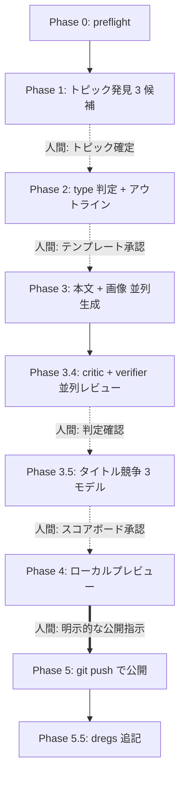
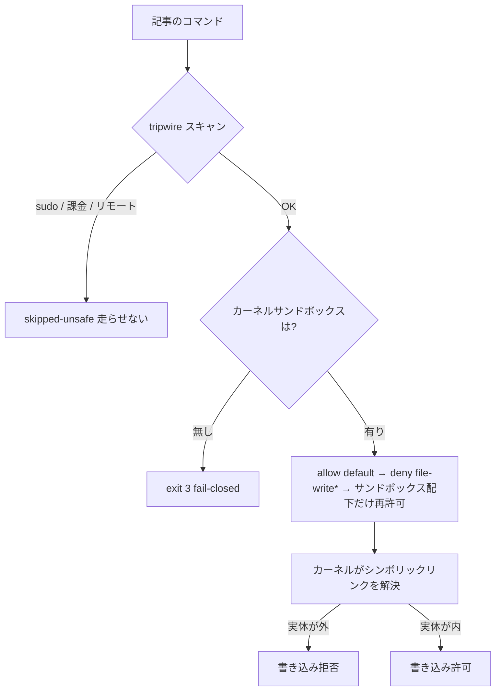

「AI に技術ブログを書かせた」。

この一言、最近そこら中で聞く。だが俺が知りたいのはそこじゃねえ。**その記事、本当に再現できるのか?** だ。

技術記事の価値は、結局そこにしかねえ。お前が手順どおりに自分のマシンで叩いて、同じものが手元に立ち上がる——それが揃って初めて記事だ。揃わなきゃただのポエムだ。海に蹴り落とせ。

俺は [Zenn](https://zenn.dev/zenn/articles/install-zenn-cli) に記事を自律で吐く `write-blog` ってスキルを Claude Code に積んでる。トークンも API もいらねえ。Zenn が GitHub 連携で「[`git push`](https://git-scm.com/docs/git-push) した瞬間に公開」してくれるから、公開手段は `git push`、監査証跡はコミット履歴そのものだ。手元のリポジトリに書いて、push して、終わり。

で、ここで最初の問いが牙を剥く。**自律で書かせた記事が「本当に再現できる」と、誰が保証する?** 書いた本人(AI)は「再現できます」と平気で言うぞ。お前らも見たことあるだろ、動かないコードに堂々と「動作確認済み」って書いてあるやつ。

この記事は二段構えだ。前半で `write-blog` の全体像を見せる。後半でその心臓——**記事が本当に再現できるかを、モデルの判断に一切頼らず、カーネルのサンドボックスで機械検証するサブシステム**を解剖する。

そして最後に落ちがある。**この記事自身が、この記事が説明する検証器に検査されて、緑が出たから公開された。** だがその検証器には、構造上どうしても検証できない一点がある——よりにもよって、この記事が一番試してほしいスニペットだ。なぜそうなるかは、最後まで取っとけ。ゲプッ。

:::message
声の話は [前回](https://zenn.dev/GeneralD/articles/pirate-captain-blogs) でやった。「AI ブログがどれも同じ書き出しになるのは、澱(沈殿)を捨ててるからだ」って話だ。今回は **仕組み** と、**その仕組みが再現性で嘘をつかないことの保証** の話だ。声は前菜、これが本題。
:::

## システム全体像 — 三層と 11 フェーズ

`write-blog` は三層でできてる。

1. **スクリプト層** — 12 本のシェルスクリプト。単一責任のハーネス群。
2. **サブエージェント層** — 4 つの [サブエージェント](https://docs.claude.com/en/docs/claude-code/sub-agents)。本文書き、タイトル職人、読者 critic、再現検証器。
3. **オーケストレーション層** — SKILL.md に書かれた 11 フェーズのパイプライン。

フェーズは Phase 0 から 5.5 まで直列に流れる。要所に **人間の承認ゲート** が刺さってる。全自動じゃねえ。「勝手に書いとけ」と投げても、**公開の直前で必ず止まる**。公開は不可逆だからだ。船は港を出る前に、船長が一度甲板に立つ。



*Phase 0→5.5 の直列フロー。点線は確認ゲート、太線(Phase 4→5)が不可逆の公開ゲート。自律モードはここで必ず止まる。*

全フェーズの一覧はこうだ。表で足りる。

| Phase | 役割 | 人間ゲート |
|---|---|---|
| 0 | preflight(Zenn repo・Codex OAuth・gh 認証チェック) | — |
| 1 | トピック発見(Gap × Demand × Expertise で 3 候補) | トピック確定 |
| 2 | type 判定 + テンプレート採点 + アウトライン | テンプレート承認 |
| 3 | 本文ドラフト + hero 画像 + spot イラスト並列生成 | — |
| 3.4 | レビュー(critic は紙上で読む / verifier はサンドボックスで実行) | critic + verifier 判定 |
| 3.5 | タイトル競争(3 モデルスコアボード) + スラッグ確定 | スコアボード承認 |
| 4 | ローカルプレビュー(自動でブラウザを開く) | プレビュー OK |
| 5 | 公開(`published: false→true`、`post:` コミット、push) | **明示的な公開指示** |
| 5.5 | dregs 追記(日付つき沈殿層を append) | — |

全スクリプトは `$ZENN_REPO`(既定で `~/.local/share/ghr/github.com/$USER/zenn-content`)を共通参照して、キャッシュは [XDG](https://specifications.freedesktop.org/basedir-spec/latest/) に従って `$XDG_CACHE_HOME/write-blog/` に集約する。`$USER` は `gh api user --jq .login` で引く。マシン固有のパスをベタ書きしねえ——これは後で効いてくる伏線だ。覚えとけ。

## 声を漏らさない設計

ここは前回の続きだから手短にやる。だが土台だから飛ばせねえ。

**声の隔離。** 人格ファイル(ろくでなし船長のこの口調そのもの)は、おそろしく強い文体の磁石だ。メインのエージェントが一度読むと、声がステータス更新にもツールの説明にも全部漏れる。だからメインは人格ファイルを **絶対に読まない**。声は本文職人(`blog-body-artisan`)とタイトル職人の **内側にだけ** 閉じ込める。メインが受け取るのはパスとプロンプトだけの構造化レポート。声をサブエージェントの樽に密封して、メインの船倉に漏らさねえ。

**澱(dregs)。** 記事を一本出すたび、何が効いて何が滑ったかを日付つきの層として append-only で沈める。AI ブログがどれも同じ顔になるのは、この澱を毎回捨てるからだ。詳しくは前回の記事をやれ。


*記事を出すたび澱が一層沈む。捨てなければ、次の一杯に深みが乗る*

**Body-first / title-last。** タイトルは本文とレビューを通った **後** に走る。事前にタイトルを決めると、書き手が一つの切り口に縛られて、実際の落ちとタイトルが食い違う。客寄せ詐欺だ。後付けなら「記事が実際に何を言ったか」を反映できる。タイトルは [Claude](https://docs.claude.com/en/docs/claude-code/overview) + [Codex](https://developers.openai.com/codex/cli/) + [Gemini](https://github.com/google-gemini/gemini-cli) の 3 モデル競争で均一採点して決める。

**盲目の読者 critic。** これが本題への橋だ。レビュー役には **ドラフトしか渡さない**。トピックも人格も澱も渡さねえ。なぜか。著者の意図を知ってる読者は、本物の読者が引っかかるギャップを無意識に許しちまうからだ。「あ、これは別ファイルに書いてあるやつね」で読み飛ばす。本物の読者はそのファイルを持ってねえ。

で、Phase 3.4 にはレビュー役が **二人** いる。critic と verifier。ここからが今日の宝だ。

## クライマックス — 再現性検証サブシステム

critic は **紙上で** 再現性を疑う。「月曜の朝、これ試せそうか?」を、読んで判断する。一行も実行しない。

verifier は **実行で** 再現性を証明する。記事に書いてあるファイルとコマンドだけを使い捨てサンドボックスに展開して、実際に走らせて、動いたかを報告する。

critic が「suspected(疑い)」なら、verifier は「empirical(実証)」だ。**食い違ったら実証側が勝つ。** critic が緑でも、verifier が「step 4 が、記事に一度も載ってない `setup.sh` を呼んでて 127 で落ちた」と実行時の証拠を出せば、それが改訂をトリガーする。疑いより証拠だ。海の上ではいつもそうだろ。

ここから先、verifier の設計を順に解剖する。一つずつ沼を踏んで、這い出した順だ。

### ① テキストスキャンは健全じゃない

最初の素朴な設計はこうだった。「危険なコマンドを正規表現で弾けばいい」。`sudo` を見たら止める、`rm -rf /` を見たら止める。簡単だろ?

健全じゃねえ。これは罠だ。

正規表現は `touch /etc/passwd` を禁止できる。だが、inline されたスクリプトの中でこう書かれてたらどうだ。

```bash
SAFE_DIR=/etc
touch "$SAFE_DIR/passwd"
```

テキストには `touch "$SAFE_DIR/..."` としか見えねえ。`SAFE_DIR` が何を指すかは **実行するまで分からねえ**。スキャンは素通りする。

もっと悪いのがシンボリックリンクだ。サンドボックスの中に見えるパスへの書き込みが、リンクを辿った先ではサンドボックスの **外** を指す。これはテキストには **一切** 見えねえ。

そして俺はこれを机上の空論で言ってるんじゃねえ。**過去の記事が、実際にシンボリックリンクで当時の境界を抜けた。** テキストだけの境界はそれを通してしまった。やられた。

結論はひとつ。**境界はテキストじゃなくカーネルに置くしかねえ。** 文字を読んで安全を判断するのをやめて、書き込みそのものをカーネルに止めさせる。

### ② 境界をカーネルへ

`repro-sandbox.sh`(322 行)の `run` は、すべてのコマンドをカーネルのサンドボックスの下で走らせる。macOS なら [`sandbox-exec`](https://keith.github.io/xcode-man-pages/sandbox-exec.1.html)(Seatbelt)、Linux なら [`bwrap`](https://github.com/containers/bubblewrap)([bubblewrap](https://github.com/containers/bubblewrap))だ。

封じ込めモデルはこうだ。



*封じ込めの判断順。tripwire は「最初から試さないクラス」を弾くだけ。本物の境界はカーネルの write-deny だ*

プロファイルの構造は「すべて許可 → **全書き込みを拒否** → サンドボックス配下のサブパスだけ書き込みを再許可」だ。Seatbelt プロファイルの実体はこれだけだ。

```bash
seatbelt_profile() {
  printf '(version 1)\n(allow default)\n(deny file-write*)\n'
  local p
  for p in "$@"; do printf '(allow file-write* (subpath "%s"))\n' "$p"; done
  printf '(allow file-write-data (subpath "/dev"))\n(allow file-ioctl (subpath "/dev"))\n'
}
```

なぜこれでシンボリックリンク脱出が塞がるか。**カーネルはマッチング前にシンボリックリンクを解決する** からだ。リンクが外を指してれば、その **実体パス** で deny に当たる。`touch /opt/homebrew/x` も、`> /tmp/x` のリダイレクトも、inline スクリプトの奥に埋めた脱出も、コマンドが何をしようが書き込み時にカーネルが止める。文字を読まずに、行為を止める。これが境界が保つ理由だ。

bwrap 側も思想は同じだ。`--ro-bind / /` で全ファイルシステムを読み取り専用でマウントして、`--bind "$sbr" "$sbr"` でサンドボックスだけ読み書き可能に戻す。外への書き込みは read-only マウントに当たって弾かれる。

#### お前ら、宝だ — 自分のコマンドを封じ込める最小版

ここが今日の payoff だ。322 行のフル版はいらねえ。読者が **コピペで自分の任意のコマンドをサンドボックスに封じ込められる** 最小核を、新しく蒸留して渡す。macOS 前提、ネット不要、単体で完結、お前の `~/.config` も `~/.zshrc` も一切汚さねえ。

```bash
#!/usr/bin/env bash
# minimal-sandbox.sh — 自分の 1 コマンドをカーネルサンドボックスに封じ込める最小核 (macOS)
set -euo pipefail

# 使い捨てのサンドボックスを作る (実ホームは汚さない)
SB="$(mktemp -d "${TMPDIR:-/tmp}/my-sandbox.XXXXXX")"
SB="$(cd "$SB" && pwd -P)"   # 正規化: /tmp -> /private/tmp。これを抜くと subpath が一致せず全拒否される
mkdir -p "$SB/home" "$SB/work"

# Seatbelt プロファイル: 全許可 → 全書き込み拒否 → サンドボックス配下だけ再許可
PROFILE="$(printf '(version 1)\n(allow default)\n(deny file-write*)\n(allow file-write* (subpath "%s"))\n' "$SB")"

# HOME をサンドボックスに振り替えて、お前のコマンドを走らせる
# 第 1 引数にコマンド文字列を渡す:  ./minimal-sandbox.sh 'touch ~/canary.txt'
CMD="${1:?usage: $0 \"<command>\"}"
sandbox-exec -p "$PROFILE" env -i HOME="$SB/home" \
  PATH="/usr/bin:/bin:/usr/sbin:/sbin" \
  sh -c 'cd "$1" || exit 1; exec sh -c "$2"' _ "$SB/work" "$CMD"

echo "---- サンドボックスの中身 ----"
find "$SB" -type f
echo "---- 後始末 ----"
rm -rf "$SB"
```

試してみろ。`./minimal-sandbox.sh 'touch ~/canary.txt'` ——`canary.txt` は `$SB/home` の中に落ちる。お前の本物のホームには一滴も漏れねえ。じゃあ脱出を試すか。`./minimal-sandbox.sh 'touch /tmp/escape.txt'` ——`Operation not permitted` で **拒否される**。サンドボックスの外に書こうとした瞬間、カーネルが手を叩き落とす。

これがフル版の心臓だ。たった数行で、お前は自分の検証したいコマンドを安全に隔離できる。**おい野郎ども、これが宝だ。** 持って帰れ。

そして三行目の `SB="$(cd "$SB" && pwd -P)"`、あれは飾りじゃねえ。`mktemp` が macOS で返すのは `/tmp/...` ——だがその実体は `/private/tmp/...` だ。カーネルは subpath を **解決後のパス** でマッチするから、`/tmp` のまま `allow` に突っ込むと一致せず、サンドボックスの **中への書き込みまで全部拒否** されて RC=1 で死ぬ。この一行を抜くと、⑦で語る xcrun confstr の沼に **自分で** 落ちる。同じ正規化だ。覚えとけ。

:::message
これは macOS の `sandbox-exec` 前提だ。Linux なら同じ思想を `bwrap --ro-bind / / --bind "$SB" "$SB"` で組める。`sandbox-exec` は man page 上は deprecated 扱いだが、現役で動くし Seatbelt 自体は macOS の生命線だ。
:::

### ③ Fail-closed — 閉じる方向に倒す

`sandbox-exec` も `bwrap` も無いホストではどうする?

env リダイレクトにフォールバックする誘惑は強い。`HOME` だけ振り替えれば「だいたい安全」に見える。スクリプトは常に動く。気持ちいい。

だがそれは **静かに安全じゃねえ**。env リダイレクトだけじゃ、シンボリックリンク脱出も、絶対パスへの `touch` も、止められねえ。inline スクリプトの `touch /opt/homebrew/x` がライブシステムに着地して、検出も警告も無い。

だから `run` は **フォールバックせず exit 3 で拒否する**。

サンドボックスが無いまま「成功」と偽るより、「環境が無い」(記事の欠陥じゃなくデプロイ制約だ)としてステップをスキップする方が安全だ。閉じる方向に倒す。これが fail-closed の決断だ。迷ったら閉めろ。海賊だって、嵐の前にはハッチを閉める。

### ④ Tripwire の降格 — 番兵とカーネルの壁は別物だ

ここで最初のテキストスキャンがどうなったか。**境界から外されて、skip 分類器(tripwire)に降格した。**


*番兵(tripwire)は門前で素行の悪い客を追い返すだけ。本物の壁(カーネル)はその後ろに立っている*

tripwire は `sudo`、グローバルインストール、認証フロー、課金、リモート変更、破壊的操作、GUI を、**カーネルサンドボックスを動かす前に** 弾く。境界じゃねえ。「最初から試さないクラス」を弾く利便性 + 多層防御だ。

誤爆を避けるために語境界アンカーを使ってる。例えば `sudo` の検出はこうだ。

```
(^|[^[:alnum:]_])(sudo|doas|su)([[:space:]]|$)
```

これで `sudo-make-me-a-sandwich` みたいなツール名に誤爆しない。`su` の前後を空白か行端でアンカーしてるからだ。

そして大事な判断。**ローカル git は許可する。** `git init` / `add` / `commit` / `checkout` / `config` は通す。`HOME` と [`GIT_CONFIG_GLOBAL`](https://git-scm.com/docs/git-config#ENVIRONMENT) がサンドボックス内へリダイレクトされてて、外への書き込みはカーネルが拒否するからだ。これで git ワークフローの記事が正しく再現する。止めるのは `git push` / `gh` / `npm publish` / `docker push` みたいな **リモートに触る** やつだけだ。

番兵は門前払い、壁は最後の砦。役割を混ぜるな。

:::details tripwire の正規表現群 — `scan_text()`
語境界アンカーで誤爆を避けながら、最初から試さないクラスを弾く。網羅的じゃない——カーネルの write-deny が本物の境界だ。

```bash
scan_text() {
  local text="$1" hits=0
  hit() { if printf '%s' "$text" | grep -Eiq "$1"; then printf 'TRIGGER: %s\n' "$2"; hits=1; fi; }
  # `su` always takes a following space or ends the token, so anchor on ws/EOL —
  # this avoids false-firing on tool names like `sudo-make-me-a-sandwich`, `su-exec`.
  hit '(^|[^[:alnum:]_])(sudo|doas|su)([[:space:]]|$)'                                     'sudo / privilege-escalation'
  hit '(brew|port)[[:space:]]+install|npm[[:space:]]+(i|install)[[:space:]]+(-g|--global)|pip3?[[:space:]]+install|cargo[[:space:]]+install|gem[[:space:]]+install|(apt|apt-get|dnf|yum|pacman)[[:space:]]+(install|-S)|mise[[:space:]]+(use|install)[[:space:]]+(-g|--global)' 'global-install'
  hit 'launchctl|systemctl|crontab|defaults[[:space:]]+write|csrutil|nvram|scutil[[:space:]]+--set' 'system-mutation'
  # Only REMOTE / external-identity git ops are blocked. Local git (init/add/
  # commit/checkout/config) is fully contained: HOME + GIT_CONFIG_GLOBAL are
  # redirected into the sandbox and the kernel denies any write outside it — so a
  # git-workflow tutorial reproduces correctly instead of false-skipping.
  hit 'git[[:space:]]+push|gh[[:space:]]+(auth|pr|issue|release)|gh[[:space:]]+repo[[:space:]]+create|npm[[:space:]]+publish|docker[[:space:]]+push' 'live-git / remote-mutation'
  hit '(op[[:space:]]+signin|aws[[:space:]]+configure|gh[[:space:]]+auth[[:space:]]+login|ssh-keygen|gpg[[:space:]]+--gen-key)'                 'auth-flow'
  hit 'curl[[:space:]].*-X[[:space:]]*(POST|PUT|DELETE|PATCH)|curl[[:space:]].*--(data|upload-file)|wget[[:space:]].*--method' 'remote-side-effect'
  hit 'rm[[:space:]]+-[a-z]*r[a-z]*f?[[:space:]]+/[^[:space:]]|mkfs|diskutil[[:space:]]+erase|dd[[:space:]]+.*of=/dev/'         'destructive'
  hit '([>]>?|tee)[[:space:]]*/(etc|usr|var|opt|System|Library|bin|sbin)/'                 'hardcoded-absolute-write'
  hit '(^|[^[:alnum:]_./])/(Users|home)/[a-zA-Z0-9._-]+/'                                  'hardcoded-home-path'
  hit '(osascript|screencapture|tccutil|open[[:space:]]+-a)'                               'gui / os-permission'
  if [ "$hits" -eq 0 ]; then printf 'OK\n'; return 0; fi
  return 3
}
```
:::

:::details ファイル配置の経路変換 — `resolve_target()`
記事が見せたパス(`~/.config/x`、`$HOME/x`、`/Users/<u>/x`)をサンドボックス相対に翻訳する。絶対パス脱出と `..` traversal は拒否。

```bash
resolve_target() {
  local sb="$1" p="$2" rel
  # Patterns match the LITERAL strings an article shows (e.g. `~/.config/x`,
  # `$HOME/x`); tilde/var expansion is deliberately NOT wanted here.
  # shellcheck disable=SC2088,SC2016
  case "$p" in
    "~")            rel="home" ;;
    "~/"*)          rel="home/${p#\~/}" ;;
    '$HOME')        rel="home" ;;
    '$HOME/'*)      rel="home/${p#\$HOME/}" ;;
    /Users/*/*)     rel="home/$(printf '%s' "$p" | sed -E 's#^/Users/[^/]+/##')" ;;
    /home/*/*)      rel="home/$(printf '%s' "$p" | sed -E 's#^/home/[^/]+/##')" ;;
    /*)             printf 'hardcoded absolute path escapes sandbox: %s' "$p"; return 1 ;;
    "./"*)          rel="work/${p#./}" ;;
    *)              rel="work/$p" ;;
  esac
  case "$rel" in *..*) printf 'path traversal not allowed: %s' "$p"; return 1 ;; esac
  case "$rel" in home|work) printf 'intended path is a directory, not a file: %s' "$p"; return 1 ;; esac
  printf '%s/%s' "$sb" "$rel"
}
```
:::

### ⑤ env -i とシェルライン実行

`run` は `env -i` で環境を空にしてから、`HOME`・全 `XDG_*`・`TMPDIR`・[`ZDOTDIR`](https://zsh.sourceforge.io/Doc/Release/Parameters.html)・git config をサンドボックス内へリダイレクトする。これは多層防御だ。読者相対の `~` / `$HOME` / glob がサンドボックス内で解決されるし、親シェルに残った迷子の `XDG_CONFIG_HOME` がツールをライブ設定に向け直すのも防ぐ。

そしてコマンドは argv じゃなく **シェルライン** として走る。

```bash
sh -c 'cd "$1" || exit 97; exec sh -c "$2"' _ "$sb/work" "$cmdstr"
```

なぜか。読者が `bash ~/.config/x` をブログからコピペすると、読者のシェルが `~` を展開する。だからハーネスも同じように展開する——ただし `HOME` がサンドボックスを指してるから、展開はサンドボックス内に着地する。読者の体験を、サンドボックスの中で忠実に再演する。

:::details コマンド実行の本体 — `cmd_run()`
backend 分岐(macOS / Linux)、`env -i` リダイレクト、シェルライン実行、exit-code 分類(3=refused / 124=timeout / 97=internal)。verifier の心臓部。

```bash
cmd_run() {
  [ $# -ge 1 ] || die "run: need <sandbox> [-- <cmd...>]  (or pipe the command on stdin)"
  local sb="$1"; shift
  is_our_sandbox "$sb" || die "not a repro sandbox: $sb"
  [ "${1:-}" = "--" ] && shift

  local cmdstr
  if [ $# -gt 0 ]; then cmdstr="$*"; else cmdstr="$(cat)"; fi
  [ -n "${cmdstr//[[:space:]]/}" ] || die "run: no command given (pass argv after -- or pipe it on stdin)"

  # Tripwire (NOT the boundary): refuse classes we won't even attempt.
  local triggers
  triggers="$(scan_text "$cmdstr" || true)"
  if [ "$triggers" != "OK" ]; then
    printf 'REFUSED (unsafe-to-sandbox — skip, do not run):\n%s\n' "$triggers" >&2
    return 3
  fi

  local backend rc=0
  backend="$(sandbox_backend)"
  if [ "$backend" = none ]; then
    printf 'REFUSED (no kernel sandbox backend: need sandbox-exec on macOS or bwrap on Linux).\n' >&2
    printf 'Refusing to run under env-redirection alone — it cannot contain symlink/absolute-path/touch escapes.\n' >&2
    return 3
  fi
  local sbr; sbr="$(cd "$sb" && pwd -P)"   # canonical path for the kernel write-deny rule

  local -a ENVV=(
    HOME="$sb/home"
    XDG_CONFIG_HOME="$sb/home/.config"
    XDG_DATA_HOME="$sb/home/.local/share"
    XDG_STATE_HOME="$sb/home/.local/state"
    XDG_CACHE_HOME="$sb/home/.cache"
    XDG_RUNTIME_DIR="$sb/run"
    TMPDIR="$sb/tmp"
    ZDOTDIR="$sb/home"
    GIT_CONFIG_GLOBAL="$sb/home/.gitconfig"
    GIT_CONFIG_SYSTEM=/dev/null
    GIT_CONFIG_NOSYSTEM=1
    LANG="${LANG:-en_US.UTF-8}"
    PATH="/usr/bin:/bin:/usr/sbin:/sbin:/opt/homebrew/bin:/usr/local/bin"
  )

  case "$backend" in
    macos)
      local prof systmp syscache; local -a allowed=("$sbr")
      systmp="$(cd "$(getconf DARWIN_USER_TEMP_DIR 2>/dev/null || echo /nonexistent)" 2>/dev/null && pwd -P || true)";   [ -n "$systmp" ]   && allowed+=("$systmp")
      syscache="$(cd "$(getconf DARWIN_USER_CACHE_DIR 2>/dev/null || echo /nonexistent)" 2>/dev/null && pwd -P || true)"; [ -n "$syscache" ] && allowed+=("$syscache")
      prof="$(seatbelt_profile "${allowed[@]}")"
      # shellcheck disable=SC2086,SC2016
      $TIMEOUT_PRE sandbox-exec -p "$prof" env -i "${ENVV[@]}" \
        sh -c 'cd "$1" || exit 97; exec sh -c "$2"' _ "$sb/work" "$cmdstr" || rc=$?
      ;;
    bwrap)
      # shellcheck disable=SC2086,SC2016
      $TIMEOUT_PRE bwrap --ro-bind / / --dev /dev --proc /proc \
        --bind "$sbr" "$sbr" --die-with-parent --unshare-pid \
        env -i "${ENVV[@]}" \
        sh -c 'cd "$1" || exit 97; exec sh -c "$2"' _ "$sb/work" "$cmdstr" || rc=$?
      ;;
  esac
  return "$rc"
}
```
:::

### ⑥ 最弱モデルをあえて選ぶ逆説

ここが一番ひっくり返る話だ。

verifier が走るのは [Haiku](https://docs.claude.com/en/docs/about-claude/models/overview)——最弱のモデルティアだ。コスト最適化じゃねえ。**設計だ。**

考えてみろ。強いモデル([Opus](https://docs.claude.com/en/docs/about-claude/models/overview) とか)に検証させたら何が起きる? 記事が「npm を入れろ」と書き忘れてても、賢いモデルは「ああ、読者はたぶん npm を入れる必要があるな」と **欠落ステップを推論で埋めて** 再現を成功させちまう。そして——記事が開示し忘れた欠陥を **隠す**。

これじゃ検証にならねえ。verifier が存在する理由そのものを潰してる。

Haiku は推論で埋めない。本物の読者が詰まる場所で、同じように詰まる。**その詰まった点こそが finding だ。** Haiku は naive-reader canary(素朴な読者のカナリア)だ。炭鉱のカナリアが弱いから役に立つのと同じで、verifier も弱いから機能する。

「でも弱いモデルに安全な隔離判断を任せて大丈夫か?」——大丈夫だ。**安全はスクリプトが強制する。モデルじゃねえ。** Haiku がどんなに悪い隔離判断を下しても、カーネルが代わりに正しい判断を下す。そもそも Haiku はカーネルサンドボックスを手で組めねえ。だから安全がモデルに依存しないことが **必須** なんだ。弱いモデルを安心して canary に使えるのは、強い壁が後ろにあるからだ。

弱さが機能する。これがこのサブシステム全体の思想を一言で象徴してる。ゲプッ。

### ⑦ 沼 — 動かして初めて出た罠

設計は綺麗に見えるだろ。だが現実は沼だ。動かして初めて分かる罠が三つあった。全部ここに置いとく。お前が同じ穴に落ちないようにな。最後の一つは、この記事を検証しようとして初めて踏んだ——一番深い沼だ。

**沼その一: xcrun の confstr ノイズ。**

カーネル境界を立てたら、git が無害な `Operation not permitted` を吐き始めた。原因を 1 時間追った。犯人は git の xcrun シムだ。こいつは `$TMPDIR` を **無視** して、[`confstr(3)`](https://man7.org/linux/man-pages/man3/confstr.3.html) 経由で OS 管理の per-user temp ディレクトリ(`DARWIN_USER_TEMP_DIR`)に書きやがる。サンドボックスが許可してないから弾かれてノイズが出る。

修正は、その OS 管理 temp/cache ディレクトリも書き込み許可に加えること。ただしここにもう一段罠がある。`getconf` が返すのは `/var/folders/...` っていう **シンボリックリンク形** だが、カーネルは解決後の `/private/var/folders/...` でマッチする。だから `pwd -P` で正規化してから許可する。

:::details xcrun confstr 許可ブロック — `cmd_run()` の macos 分岐
`DARWIN_USER_TEMP_DIR` / `DARWIN_USER_CACHE_DIR` を再許可しつつ、`pwd -P` で `/var`→`/private/var` を正規化する。

```bash
macos)
  # Also permit the OS per-user temp/cache dirs so confstr-based tools (git's
  # xcrun shim, etc.) don't spew non-fatal "Operation not permitted" noise.
  # Canonicalize (pwd -P) — getconf returns the /var symlink form, but the
  # kernel matches on the resolved /private/var path.
  local prof systmp syscache; local -a allowed=("$sbr")
  systmp="$(cd "$(getconf DARWIN_USER_TEMP_DIR 2>/dev/null || echo /nonexistent)" 2>/dev/null && pwd -P || true)";   [ -n "$systmp" ]   && allowed+=("$systmp")
  syscache="$(cd "$(getconf DARWIN_USER_CACHE_DIR 2>/dev/null || echo /nonexistent)" 2>/dev/null && pwd -P || true)"; [ -n "$syscache" ] && allowed+=("$syscache")
  prof="$(seatbelt_profile "${allowed[@]}")"
  ...
```
:::

**沼その二: Haiku の偽陰性。** これが一番タチが悪かった。

verifier(Haiku)が、**安全なコマンドを `NOT_REPRODUCIBLE` と誤判定した。** 最初は「やっぱ弱いモデルはダメか」と思った。が、犯人はモデルじゃなかった。

verifier がこう書いた。

```bash
run "$SB" -- bash ~/x.sh
```

argv 形式だ。この `~` を展開するのは誰だ? **verifier 自身のシェル** だ。ハーネスに届く前に `~` が `/Users/<agent>/x.sh` に **先に展開** される。そして、それが `hardcoded-home-path` の tripwire を踏む。安全なコマンドが、シェルの先行展開のせいで false NOT_REPRODUCIBLE で拒否されてた。

これはモデルの賢さの問題じゃねえ。**シェルの意味論の罠** だ。弱いモデルのバグに見えて、実は誰が `~` を展開するかの問題だった。

修正は quoted heredoc だ。before / after で見せる。

```bash
# Before — 偽陰性。caller のシェルが ~ を /Users/<agent>/... に先行展開して tripwire を踏む
run "$SB" -- bash ~/x.sh

# After — シングルクォート heredoc が caller 側の展開を完全にブロックする
run "$SB" <<'CMD'
bash ~/.config/x.sh
CMD
```

シングルクォートの heredoc(`<<'CMD'`)が、呼び出し側の展開を **完全に** ブロックする。コマンドはリテラルでハーネスに届いて、内側の `sh -c`(サンドボックスの `HOME` を持つ)が `~` をサンドボックス内に展開する。`~` / `$HOME` / glob を含む読者貼り付けコマンドを安全に渡せる **唯一** の方法だ。

3 時間溶かした。だがこの罠を踏んだおかげで、「誰が文字列を展開するか」を常に意識する癖がついた。授業料としては安い。ゲプッ。

**沼その三: サンドボックスは入れ子にできない。** これは、この記事を検証しようとして初めて踏んだ沼だ。

俺は当然こう考えてた。「上で渡した `minimal-sandbox.sh`、これを verifier に実際に走らせて緑を取れば、メタ的に完璧な落ちになる」。やってみた。verifier がサンドボックスの中でスニペットを実行した瞬間、こう突き返された。

```
sandbox-exec: sandbox_apply: Operation not permitted
```

RC は 71。意味が分かるまで少し掛かった。**verifier 自身がカーネルサンドボックスの中で走ってる。** その内側で `minimal-sandbox.sh` を叩くと、スニペット中の `sandbox-exec` が **入れ子の `sandbox_apply`** になる。そして Seatbelt は入れ子を許さねえ。一度サンドボックスに入ったら、その中から **新しいサンドボックスを適用できない**。カーネルが `sandbox_apply: Operation not permitted` で叩き落とす。

これは負けじゃねえ。むしろこの記事で一番深い真実だ。**Seatbelt サンドボックスは一方通行の扉なんだ。** 中に入ったら、中からもう一枚の扉は作れない。境界が本物だからこそ、境界の上にもう一枚境界を立てられねえ。お前が②で持ち帰ったあのスニペットの力は、まさにこの非ネスト性に裏打ちされてる。ゲプッ。

### ⑧ 失敗のフォレンジクス

最後に後始末の話だ。ライフサイクルは明示してる——`new → put → scan → run → tree → clean`。trap ベースの自動削除は **使わない**。

なぜか。Claude の各 Bash 呼び出しは新しいシェルだ。`trap ... EXIT` を仕掛けると、次のステップが走る前にサンドボックスを消しちまう。だから手動だ。

そして肝心のルール。

- **緑(全部 clean)のときだけ `clean`** してサンドボックスを消す。
- **赤(失敗)のときは `tree` して保存する。** crime scene(犯行現場)を残す。

失敗したサンドボックスを消すな。何がそこにあって、何が無かったかが、改訂の証拠だ。`clean` はマーカーファイル `.repro-sandbox` を持つ、俺たちが作ったサンドボックスにしか効かない。空の引数や変なパスが間違っても `rm -rf` に化けないように、二重に守ってる。

## メタ落ち — verifier が唯一手渡せなかった宝

さて。ここまで `blog-repro-verifier` の設計を解剖してきた。テキストじゃなくカーネルで封じ込める。fail-closed で倒す。最弱モデルを canary に据える。沼を三つ埋めた。

で、ここからが落ちだ。

**この記事自身が、この記事が説明した `blog-repro-verifier` に、Phase 3.4 で実際に検査された。** 手順、コマンドの形、パスの取り回し——この記事の **再現可能な土台** を、Haiku の verifier が使い捨てサンドボックスの中で一つずつ確かめた。緑が出た。だから今、お前はこれを読めてる。

だが、verifier が **どうやっても検査できなかった一点** がある。よりにもよって、この記事が一番試してほしいスニペット——②で渡した `minimal-sandbox.sh` だ。

理由は沼その三で踏んだとおりだ。**verifier 自身がカーネルサンドボックスの中で走ってる。** その内側であのスニペットを叩くと、中の `sandbox-exec` が入れ子の `sandbox_apply` になって、カーネルが `Operation not permitted` で突き返す。Seatbelt サンドボックスは一方通行の扉だ。中に入ったら、中からもう一枚の扉は作れねえ。だから verifier は、この一点だけはどう逆立ちしても走らせられない。

これは欠陥じゃねえ。**境界が本物である、何より硬い証拠だ。** もしスニペットがサンドボックスの中で平気で動いたなら、それは封じ込めが嘘だったってことだ。動かないからこそ、壁が本物だと分かる。

だから verifier はこのスニペットを、俺の代わりに——**お前の素のターミナルに手渡す**。「これは俺が走らせてやれない唯一の宝だ。お前のマシンで叩け」と。だから三行目の `pwd -P` まで含めて、お前の素のマシンで確実に動くように書いた。絶対パスのベタ書きは禁止。`~` / `$HOME` / `mktemp` を使う。sudo もグローバルインストールもリモートも無い。ネット不要。単体で完結。コピペして `chmod +x` すれば、今すぐ動く。

冒頭の問いを覚えてるか。「自律で書かせた記事が、本当に再現できると誰が保証する?」

答えは、この記事の構造そのものだ。**保証するのは人間の善意でも、AI の自己申告でもない。カーネルのサンドボックスで再現可能な土台を実際に検証して、緑が出たことだ。** お前が今これを読めてるってことは——この記事の土台は verifier の緑を通った、ってことだ。そしてサンドボックスのデモ本体だけは、入れ子にできないという性質ゆえに、お前に託された。その非ネスト性こそが、境界が本物である証拠だ。

記事が自分の主張で自分を検査する。検査しきれなかった一点すら、主張の正しさを証明する。これが北極星だ。

ゲプッ。

## 次の一手

- **自分のコマンドを封じ込めたいなら**、上の `minimal-sandbox.sh` をコピーして `chmod +x` して走らせろ。macOS なら今すぐ動く。Linux なら `sandbox-exec` の行を `bwrap --ro-bind / / --bind "$SB" "$SB"` に置き換えろ。
- **声と澱の話が気になったら** [前回](https://zenn.dev/GeneralD/articles/pirate-captain-blogs) をやれ。今回の「仕組み」の前提になってる「なぜ AI ブログはどれも同じ顔か」の話だ。
- **隔離のテーマでもう一本** 読むなら、Claude を放置運用するための [1Password の庫分離](https://zenn.dev/GeneralD/articles/claude-code-1password-vault-isolation) もこれと韻を踏んでる。「Claude を放置で回す」と「再現実行を live env から隔離する」は、同じ「触らせない設計」の裏表だ。

道具は渡した。あとはお前の船で好きにしろ。

### 関連記事

@[card](https://zenn.dev/GeneralD/articles/pirate-captain-blogs)
@[card](https://zenn.dev/GeneralD/articles/claude-code-1password-vault-isolation)
@[card](https://zenn.dev/GeneralD/articles/claude-code-twin-bar-rate-compass)
