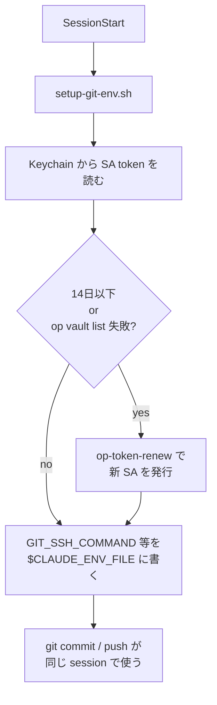
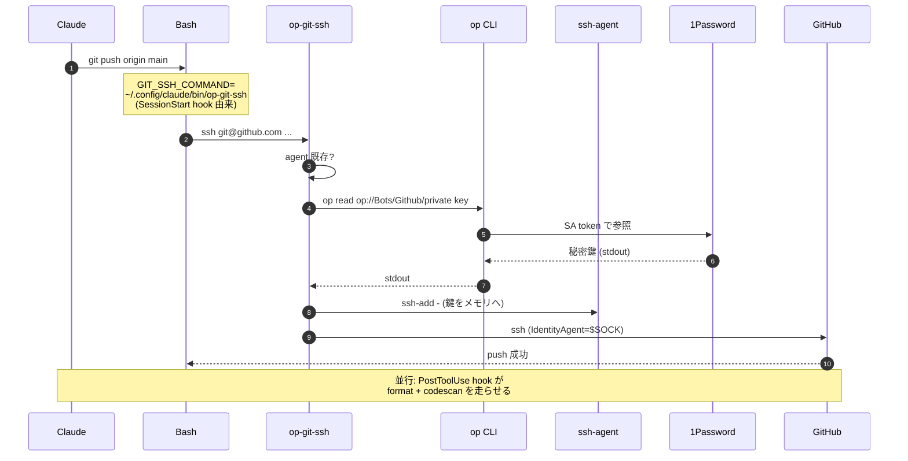

## 1. お前らが Claude を放置で動かしたくなった時に詰まる場所が二つある

お前ら、Claude Code を放置気味で走らせたいと思ったことがあるだろう。
夜中の長尺タスクを投げて、朝になったら結果だけ眺めたい。出先からスマホで「あの修正やっとけ」と命令して、戻る頃には終わっていてほしい。
俺もそう思って配線を組んでみたら、現実的に詰まる場所が二つあった。

一つ目は **権限の塊問題**。AI に password manager を読ませる構成は、素朴に組むと「全 vault の鍵を渡す」になる。
これは普通に怖い。SSH 鍵も API トークンも家計簿の口座情報も、全部同じ庫の中に積んである。その庫の鍵束を、寝てる間に動いてる船員に丸ごと渡す——お前、それやれるか? 俺は躊躇した。

二つ目は **対面 unlock 前提との衝突**。1Password のデスクトップ統合は良くできてる。良くできすぎてて、Touch ID で守られていることが本質だ。
画面の前に人間が居ない時間に Claude が `git push` を投げると、生体認証のダイアログが宙に浮いたまま誰も応答できず、タスクが静かに死ぬ。
セキュリティの強さがそのまま放置運用の壁になってる、そういう状態だった。

この二つを同時に解く配線を組んだから、辿った道筋を書き残しておく。
中心の判断は一つだけだ。残りは全部その判断から勝手に派生してきた。ゲプッ。

## 2. 設計の核: blast radius を vault 単位で絞れ


最初に置いた判断はこれだ。「**AI に渡す権限は、別の庫に切り出してから渡す**」。
パターンとして名付けるなら **blast radius を vault 単位で絞る**。
blast radius、つまり爆発の半径だ。漏れた時に何が燃えるかを、樽の境界で物理的に切り分ける、ってことだ。

1Password には Service Account という仕組みがあって、特定 vault に対する権限だけを持つ非対面トークンを発行できる。これが宝だ。
そこで、人間が普段使う vault とは別に **Bots** という樽を一つ切り出して、SSH 鍵みてえな「AI が触っていい資格情報」だけをそこに放り込んだ。
発行する SA トークンは Bots vault に `read_items` のみ、他の vault には一切手が届かねえ。

```
+----------------------------------+
|  1Password Account               |
|                                  |
|  +--------+   +--------+         |
|  | Private|   | Work   |   ← 人間専用 (Touch ID)
|  +--------+   +--------+         |
|                                  |
|  +-----------------------+       |
|  | Bots vault            |   ← SA token はここだけ見える
|  |  - Github (SSH 鍵)    |       |
|  |  - その他 AI 用       |       |
|  +-----------------------+       |
+----------------------------------+
```

対案は一つ、「人間と同じ vault に全権アクセスのトークンを発行する」というやり方だ。
配線は楽だ。だがトークンが漏れた瞬間に全資格情報が露出する。海に蹴り落とせ、こいつは。浮き輪はやる、また拾え。
**blast radius を絞る** ってのは要するに、この一行を選ばねえという判断のことだ。

この一点が決まると、残りの設計判断が驚くほど素直に並ぶ。
「Claude に password manager を渡す」という、普通なら反射的に拒否したくなる構成が、樽の境界を一段絞っただけで「まあ、それくらいなら」に変わる。
庫を分ければ正気を保てる。それだけの話だ。

## 3. 認証チェーン: 鍵が何段を通ってくるか


権限が絞れた。次は、その絞った権限を Claude にどう手渡すかを設計する。
鍵を扱う層は何段かに分かれてる。上から順に役割を覗いていけば見通しは効く。

### 3.1 SA トークン本体は Keychain に置く

トークンを `~/.zshrc` の `export` で配ると、長命なプロセスが起動時点の値を凍結して持ち続ける。これが罠だ。
Claude Code の `claude daemon` は UI を再起動してもプロセスが生き残るタイプだから、トークンを rotate しても古い値を握ったまま、`op read` が突然「Service Account Deleted」を吐き始める。俺は最初これで沼った。

だから保管場所は環境変数じゃなく macOS の Keychain にしろ。
**Keychain が source of truth、環境変数は信用ならねえキャッシュ** と思え。

```bash
# 初期投入だけ手動。以後は op-token-renew が -U で上書きする。
security add-generic-password \
  -a "$USER" \
  -s OP_SERVICE_ACCOUNT_TOKEN \
  -w 'ops_xxx...' \
  -U
```

### 3.2 git の SSH 経路 — op-git-ssh

git の SSH 通信は `GIT_SSH_COMMAND` 経由で wrapper に流す。
役目は単純だ。「1Password から SSH 秘密鍵を取り出し、専用 ssh-agent に流し込んで `ssh` を起動する」、それだけ。

```bash:~/.config/claude/bin/op-git-ssh
SOCK="${TMPDIR:-/tmp}"
SOCK="${SOCK%/}/op-git.sock"

if ! SSH_AUTH_SOCK="$SOCK" ssh-add -l >/dev/null 2>&1; then
  rm -f "$SOCK"
  ssh-agent -a "$SOCK" >/dev/null
  if ! PRIV=$(op read 'op://Bots/Github/private key' 2>&1); then
    cat >&2 <<EOM
op-git-ssh: failed to read SSH private key from 1Password.
The SA token is likely expired or revoked. Rotate it with: op-token-renew
EOM
    exit 1
  fi
  printf '%s\n' "$PRIV" | SSH_AUTH_SOCK="$SOCK" ssh-add - >/dev/null
  unset PRIV
fi

exec ssh -o IdentityAgent="$SOCK" "$@"
```

鍵そのものはディスクに落とさねえ。ssh-agent のメモリ内と、IPC ソケットの存在だけが副作用だ。
ソケットを `$TMPDIR` 直下に置いてるのは、小さな罠を踏んだ結果。`XDG_RUNTIME_DIR` を macOS で `~/Library/Application Support` に向けてる設定だと、パスに空白が混じって `ssh -o IdentityAgent=...` が壊れる。やられた。

### 3.3 コミット署名経路 — op-git-sign

GitHub の Verified バッジを保ちたきゃ SSH 署名も同じ鍵で回す必要がある。
ここで一つ躓いた。`gpg.ssh.program` で呼ばれる `ssh-keygen -Y sign` は **`GIT_SSH_COMMAND` を経由しねえ**。
つまり transport 用の wrapper だけ書いても、署名はデフォルトの `SSH_AUTH_SOCK` を見にいって失敗する。これは罠だ。3 時間溶かしたぞ俺は。

仕方なく署名用にもう一枚 wrapper を置いて、同じソケットを共有させた。

```bash:~/.config/claude/bin/op-git-sign
SOCK="${TMPDIR:-/tmp}"
SOCK="${SOCK%/}/op-git.sock"

if ! SSH_AUTH_SOCK="$SOCK" ssh-add -l >/dev/null 2>&1; then
  rm -f "$SOCK"
  ssh-agent -a "$SOCK" >/dev/null
  op read 'op://Bots/Github/private key' \
    | SSH_AUTH_SOCK="$SOCK" ssh-add - >/dev/null
fi

SSH_AUTH_SOCK="$SOCK" exec /usr/bin/ssh-keygen "$@"
```

push と署名で同じソケット = 同じ agent を共有してるから、`op read` はセッション中に一度しか起きねえ。
鍵が複数回 1Password を往復する無駄を避けつつ、置く場所はやはりメモリだけ。これでいい。

### 3.4 ステータスラインの可視化と自動 rotate — 期限を覚える作業は船から下ろせ

SA トークンには内省可能な有効期限がねえ。これが地味に厄介で、何の警告もなく 90 日目に突然全てが止まる、というシナリオが普通にあり得る。
ローカルに有効期限を書き留めとく仕組みと、ステータスラインへの常時表示を組み合わせて、忘却そのものを設計から海に蹴り落とした。

薄いツールを二つ置く。

**op-token-expiry** は単一の ISO 日付ファイル (`$XDG_CACHE_HOME/claude-ssh/op-token-expiry`) を読み書きするだけのラッパで、`--set YYYY-MM-DD` で記録し、`--days` で残日数を返す。やってるのは引き算だけ。馬鹿みたいに単純な道具ほどよく効く。

```bash:~/.config/claude/bin/op-token-expiry (核の部分)
STATE="${XDG_CACHE_HOME:-$HOME/.cache}/claude-ssh/op-token-expiry"
WARN_THRESHOLD_DAYS=14

remaining_days() {
  [ -s "$STATE" ] || { printf '?\n'; return 1; }
  exp_date=$(<"$STATE")
  exp_epoch=$(date -j -f '%Y-%m-%d' "$exp_date" +%s)
  today_epoch=$(date -j -f '%Y-%m-%d' "$(date +%Y-%m-%d)" +%s)
  printf '%d\n' "$(( (exp_epoch - today_epoch) / 86400 ))"
}

case "${1:-}" in
  --set)  mkdir -p "$(dirname "$STATE")"; printf '%s\n' "$2" > "$STATE" ;;
  --days) remaining_days ;;
esac
```

**op-token-renew** が更新本体だ。ユーザー認証 (デスクトップ統合) で新しい SA を発行し、Keychain を上書きし、有効期限ファイルも更新する。

```bash:~/.config/claude/bin/op-token-renew (核の部分)
set -euo pipefail
EXPIRY_DAYS="${OP_RENEW_EXPIRY_DAYS:-90}"   # op CLI cap: 1–90
VAULT_PERM="${OP_RENEW_VAULT_PERM:-Bots:read_items}"
NAME="${OP_RENEW_NAME_PREFIX:-claude-bots}-$(hostname -s)-$(date +%Y%m%d-%H%M%S)"

# 1. ユーザー認証経路を使うため OP_SERVICE_ACCOUNT_TOKEN を一時的に外す
env -u OP_SERVICE_ACCOUNT_TOKEN op vault list >/dev/null   # 認証チェック

# 2. 新 SA を発行
NEW_TOKEN=$(env -u OP_SERVICE_ACCOUNT_TOKEN op service-account create "$NAME" \
  --vault "$VAULT_PERM" --expires-in "${EXPIRY_DAYS}d" --raw)

# 3. Keychain を更新 (-U で既存エントリを上書き)
security add-generic-password -a "$USER" -s OP_SERVICE_ACCOUNT_TOKEN \
  -w "$NEW_TOKEN" -U

# 4. 有効期限ファイルを更新
EXPIRY_DATE=$(date -j -v+"${EXPIRY_DAYS}"d +%Y-%m-%d)
op-token-expiry --set "$EXPIRY_DATE"

# 5. 新トークンで疎通確認
env OP_SERVICE_ACCOUNT_TOKEN="$NEW_TOKEN" op vault list >/dev/null
```

ステータスラインには `󱚫 67d` みたいな小さなバッジが常に出てて、14 日以下に減るとアイコンが警告色に切り替わる。表示自体は `op-token-expiry --days` を呼ぶだけのワンライナーだ。

:::message
**op CLI の expires-in 上限は 90 日**。Web UI ならもっと長く設定できるが、`op service-account create --expires-in` は 2160h を超えると拒否する。あと、SA は CLI から削除できず、アカウントごとに 100 SA の上限がある。古い SA は Web UI で適宜片付ける運用になる。覚えとけ。
:::

ここまで来ると、token rotation を「絶対に忘れねえ作業」じゃなく「気付いたら走り終わってる作業」に変えられる。記憶力に頼るのをやめろ。船員の記憶は塩水で錆びる。

## 4. hook フロー: git/github 操作の前後に挟まる層

鍵と署名の経路は組めた。だがこれらが Claude Code のプロセスから自然に見えるようにするには、もう一段配線が要る。
それが hook 層だ。



役者は一人、SessionStart で走る `setup-git-env.sh` だ。
こいつが、その session で git が使う全ての環境変数を `$CLAUDE_ENV_FILE` に書き込む。
`GIT_SSH_COMMAND`、`gpg.format`、`user.signingkey`、`gpg.ssh.program`——これらを動的に組み立ててから書き出すのが要点。
静的な settings ファイルに直書きすると `$HOME` が展開されず絶対パスを強制されちまい、機械に縛りつけられた設定になっちまう。複数台で航海する身としては、ここは譲れねえ。

(別系統の hook として PreToolUse での mise 起動や PostToolUse での `find-debug` / format 実行も並行で動いてるが、こいつらは auth の本筋とは独立した話で、ここでは触れねえ。)

特筆すべきは `setup-git-env.sh` の中にある **二系統の自動 rotate トリガ** だ。

```bash:~/.config/claude/hooks/setup-git-env.sh
AUTO_RENEW="${OP_AUTO_RENEW:-1}"
if [ "$AUTO_RENEW" = "1" ]; then
  renew_reason=""
  DAYS=$("$CFG/claude/bin/op-token-expiry" --days 2>/dev/null || true)
  if [[ "$DAYS" =~ ^-?[0-9]+$ ]] && [ "$DAYS" -le 14 ]; then
    renew_reason="token expires in ${DAYS}d"
  elif ! op vault list >/dev/null 2>&1; then
    renew_reason="token probe failed (SA likely deleted or revoked)"
  fi

  if [ -n "$renew_reason" ]; then
    echo "setup-git-env: $renew_reason, auto-rotating…" >&2
    "$CFG/claude/bin/op-token-renew" >&2
  fi
fi
```

(a) **暦の門**: `op-token-expiry --days` が 14 以下を返したら rotate。
(b) **プローブの門**: 暦上は有効でも `op vault list` が失敗したら rotate。

(a) はローカルファイルを読むだけだから速い。が、Web UI で SA を消されたケースは検知できねえ。
(b) はネットワークを一往復するが、人間が 1Password の管理画面から消した SA も拾える。
二つの門があるおかげで、「期限切れ」と「管理側削除」のどっちでも勝手に直る、という性質を作ってる。お前ら、二枚の浮き輪を別の場所に括り付けるのは航海の基本だ。

ローテーションのスケジューラは launchd でも cron でもなく、Claude が次に session を始めた瞬間そのものだ。
これは設計上の選択。放置運用なら session の頻度自体が高えから、別途デーモンを置くより早く確実に発火する。ゲプッ。

## 5. クライマックス: `git push` が成立するまでの軌跡


ここまでの部品が、Claude が `git push origin main` と一行打った瞬間にどう動くか、シーケンス図で辿る。お前らがどっか部品をすり替えても、この絵の同じ位置に同じ役割の何かがハマってないと回らねえ、ってことが見えるはずだ。



順を追うとこうだ。

1. Claude が `git push` を発行する。
2. `GIT_SSH_COMMAND` は SessionStart hook が既に仕込んでくれてるから、`ssh` の代わりに `op-git-ssh` が呼ばれる。
3. `op-git-ssh` は専用ソケット `$TMPDIR/op-git.sock` を覗き、ssh-agent が生きてるか確認する。
4. いなけりゃ `ssh-agent` を起動し、`op read 'op://Bots/Github/private key'` で 1Password から鍵を引く。
5. 引いた鍵を `ssh-add -` で agent に流し込む (この間、鍵はパイプとメモリだけを通る)。
6. `ssh -o IdentityAgent=$SOCK git@github.com ...` で GitHub に到達。
7. push が通る。コミットの署名は別の wrapper が **同じ** ソケットを共有して引き継ぐ。

人間は一度も認証画面を見てねえ。
Touch ID も出ない、パスフレーズも訊かれない、SSH 鍵がディスクに書き出されることもない。
それでいて、もし SA トークンが漏れた場合の被害範囲は Bots vault 一つの中だけ。これが効いてる。
**blast radius を絞った** から、この経路を信頼できる。お前ら、構図を逆にして覚えとけ——信頼できるから絞ったんじゃねえ、絞ったから信頼できるんだ。

セッション内で二回目以降の push は、`ssh-add -l` で agent が生きてると分かるから 1Password に往復しねえ。
発火コストはセッション開始直後の一回だけ。

## 6. お前らがやるなら、こう並べろ

最低限の配線を順に並べる。
お試しなら、上から順に貼っていけば動く形にしてある。許可は要らねえ。手を動かせ。

:::message
**前提**

- macOS (Keychain と `security` コマンドを使う)
- [1Password CLI](https://developer.1password.com/docs/cli/) (`brew install 1password-cli`) と、デスクトップ統合が有効な 1Password 8 アプリ
- 1Password アカウント上で Service Account を発行できる権限 (Teams / Business プラン、または個人プランで Developer 機能が有効)
- Claude Code 本体 (`hooks` と `$CLAUDE_ENV_FILE` を使う)
- 標準で入ってる `ssh-agent` / `ssh-add` / `ssh-keygen` (macOS 既定)

最終的にこういう配置になる:

```
~/.config/claude/
├── bin/
│   ├── op-git-ssh         # SSH transport wrapper
│   ├── op-git-sign        # SSH signing wrapper
│   ├── op-token-renew     # SA rotation
│   └── op-token-expiry    # expiry tracker
├── hooks/
│   └── setup-git-env.sh   # SessionStart hook
└── settings.json
```
:::

**1. Bots vault と SA を作る**

1Password の Web UI で `Bots` vault を切り、SSH 鍵を `Github` というアイテム名で放り込む。
そのあと `op-token-renew` で SA を発行する (初回はトークン作成だけ自分でやってもいい)。

**2. Keychain にトークンを瓶詰めする**

```bash
security add-generic-password \
  -a "$USER" \
  -s OP_SERVICE_ACCOUNT_TOKEN \
  -w 'ops_eyJ...' \
  -U
```

**3. wrapper を 2 本配置**

`~/.config/claude/bin/op-git-ssh` と `~/.config/claude/bin/op-git-sign` を作って実行権限を付けろ。
中身は § 3.2 / 3.3 の通り。

**4. SessionStart hook を仕込む**

`~/.config/claude/hooks/setup-git-env.sh` の核は、Keychain から token を読んで env file に書く部分だ。

```bash:~/.config/claude/hooks/setup-git-env.sh
if KC_TOKEN=$(security find-generic-password \
                -a "$USER" -s OP_SERVICE_ACCOUNT_TOKEN -w 2>/dev/null); then
  OP_SERVICE_ACCOUNT_TOKEN="$KC_TOKEN"
  unset KC_TOKEN
fi
[ -n "${OP_SERVICE_ACCOUNT_TOKEN:-}" ] || exit 0
export OP_SERVICE_ACCOUNT_TOKEN

CFG="${XDG_CONFIG_HOME:-$HOME/.config}"
CACHE="${XDG_CACHE_HOME:-$HOME/.cache}"
PUBKEY="$CACHE/claude-ssh/github.pub"

# (二系統 auto-rotate は § 4 のブロックを挿入)

if [ ! -s "$PUBKEY" ]; then
  mkdir -p "$(dirname "$PUBKEY")"
  op read 'op://Bots/Github/public key' > "$PUBKEY"
fi

cat >> "$CLAUDE_ENV_FILE" <<EOF
export OP_SERVICE_ACCOUNT_TOKEN="$OP_SERVICE_ACCOUNT_TOKEN"
export PATH="$CFG/claude/bin:\$PATH"
export GIT_SSH_COMMAND="$CFG/claude/bin/op-git-ssh"
export GIT_CONFIG_COUNT=3
export GIT_CONFIG_KEY_0=gpg.format
export GIT_CONFIG_VALUE_0=ssh
export GIT_CONFIG_KEY_1=user.signingkey
export GIT_CONFIG_VALUE_1="$PUBKEY"
export GIT_CONFIG_KEY_2=gpg.ssh.program
export GIT_CONFIG_VALUE_2="$CFG/claude/bin/op-git-sign"
EOF
```

**5. settings.json で hook を登録**

```json:~/.config/claude/settings.json
"hooks": {
  "SessionStart": [
    {
      "matcher": "",
      "hooks": [
        { "type": "command", "command": "\"$CLAUDE_CONFIG_DIR/hooks/setup-git-env.sh\"" }
      ]
    }
  ]
}
```

**6. 有効期限を記録**

```bash
op-token-expiry --set 2026-08-20
```

これで `claude` を起動した瞬間に SessionStart hook が走り、env file が書かれ、`git push` が SSH 認証ダイアログ無しで通るようになる。お前らの船から、ダイアログという足枷が一つ消える。

## 7. 落とし穴 — 俺が踏んで生き残った罠の話


実際に組んでみた野郎にだけ刺さる種類の罠を、踏んだ順に置いておく。澱だ。読んどけ。

:::message alert
**SA トークンを `docker run -e OP_SERVICE_ACCOUNT_TOKEN=...` で渡すな**

`-e KEY=VALUE` 形式の引数は `ps aux` で同じホストの他ユーザから丸見えだ。
共有マシンや CI ランナーで Claude 関連のコンテナを起動する場合、これは実質的な漏洩経路。即座に海に蹴り落とせ。
コンテナに渡したけりゃ `--env-file` で一時ファイル経由にするか、コンテナ内から直接 Keychain / Vault を引かせる構成にしろ。
:::

@[card](https://zenn.dev/GeneralD/articles/pirate-captain-blogs)

(↑ 前回記事の公開直後、MCP server を docker で動かす導線でこの罠を踏みかけた。書いて公開した直後に自分の配線を見直して気付くタイプのやつだ。書くって作業はこれが効く。)

**vault を分けねえとここまでの全部が崩れる**

`blast radius を vault 単位で絞る` という § 2 の判断は、全ての安心感の元だ。
ここを横着して `Private` vault 全権の SA を発行すると、漏洩時の被害は SSH 鍵だけじゃなく、家計簿も API キーも保存してあるパスワードも全部に広がる。
組み立ての途中で「vault 分けるの面倒だな」と思ったら、そこは戻ってやり直せ。樽の切り直しは早いほど痛みが少ねえ。

**ローテーション漏れは静かに来る**

二系統の auto-rotate を入れてても、`op vault list` 自体が走れねえ (ネットワーク無し、`op` CLI 未インストール) と暦の門だけになる。
オフライン中に期限を踏むと、復帰後の最初の session で初めて気付くことになる。気付いた頃には日が変わってる。
ステータスラインの `󱚫 Nd` 表示が地味に効くのはここで、毎セッション「あと何日」が目に入る状態を作っときゃ、暦の門が機能しねえシナリオでも先に気付ける。

**`IdentitiesOnly=yes` を付けたくなるが付けるな**

セキュリティ感覚的に「`IdentitiesOnly=yes` のほうが厳密」と思いたくなる。俺もそう思った。だがこれは「agent から鍵を取らず明示的な `-i <file>` のみ使う」って意味だから、agent 経由の設計と真っ向から衝突する。
今回の構成は専用 agent ソケットに Github 鍵だけしか入らねえから、`IdentitiesOnly` を外しても他の identity が混入する経路がそもそも存在しねえ。安全のつもりが船を沈める呪文になるパターン、これは典型例だ。

## 8. 次の一手

ここまで辿ってみると、配線は意外に少なくて、判断は一つだけだったことが分かる。

> **AI に渡す権限は、別の庫に切り出してから渡す**

ここを起点にしねえと、後段の hook 層や agent 共有や auto-rotate は組み立てても落ち着かねえ仕掛けにしかならねえ。
逆にここさえ抑えれば、残りの細部は「同じ方向に向かう部品」として素直に並ぶ。樽の境界が、設計の重力場を作るって話だ。

次にやってみたいことを並べる。

- **vault をもう一段分ける**。Github 用と、外部 API 用で別の SA を発行できるなら、漏洩時の被害圏をもう一段絞れる。樽の中にもう一個小さな樽。入れ子の航海だ。
- **MCP server 側の secret 取り回し**。今は env で渡してる秘密も、可能なら起動時に `op read` で引く設計に寄せる。`-e` 漏れの罠を構造的に消しちまいたい。
- **statusline 表示の精緻化**。残日数だけじゃなく、最後に rotate した SA 名や残りの SA 枠 (100 上限) も視界に入れたい。

放置運用は、強い権限を AI に渡す話に見えて、実は「庫の境界をどこで引くか」って設計問題だった。
そして境界が決まると、残りは退屈なくらい素直に並ぶ。
静かに動き続ける配線は、退屈に作るのが正解なのかもしれねえ。ゲプッ。お前らの船でも、好きに組んでみろ。
