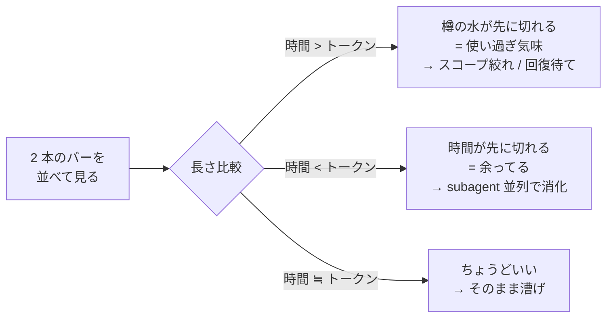

港までの距離と、樽の水の残り。船で命を握る数字はこの二つだけだ。
甲板に立つ船長が、毎秒それを別々の頭で計算してると思うか？ しねえよ。
目で見て、長さを比べて、終わりだ。

ところがな、Claude Code を回してる俺たちは、画面の隅で毎度それを計算してた。
「あと 3 時間 45 分でリセット」「トークンは 47% 残ってる」——並べてどうする。お前、その二つを頭の中で照らし合わせて、「あ、いま余ってるな」「あ、足りねえな」って秒で判定できるか？ 俺はできなかった。3 時間溶かして気付いた。**ペース配分は計算じゃねえ、視覚だ**。

二本のバーを上下に積んで、長さを目で比べる。それだけで俺の航海は静かになった。今日はその話だ。ゲプッ。

## 解決したい問題

Claude Code には二種類の波がある。**5 時間ウィンドウ** と **1 週間ウィンドウ**。どっちもトークンの上限と、リセットまでの時間がある。

ペース配分を間違うとどうなるか。俺は両方やった。

- リセットまで時間あるのにトークンを使い切って、4 時間棒立ち。クルーは港で酔っ払って待ちぼうけ。
- 逆に、リセット前にトークンが枯渇して、長尺タスクの途中で詰まる。航海日誌が中途半端なまま樽が空になる。

どっちも「数字が並んでるのを見ても、頭の中で計算してた」のが原因だ。`3h45m / 47%` を眺めて何分か考えてる時点で、お前の脳味噌は航海じゃなくて算盤やってる。

## この記事を読み終えたら手に入るもの

- pure-bash で動く、二段縦並びの Claude Code statusline スクリプト（依存は `bash` と `jq` だけ）
- 「時間バー > トークンバー」「時間バー < トークンバー」「同じくらい」の三択でペースが瞬時に判る目
- 余ってる時に subagent を並列で出して航海を加速する pacing 戦略
- statusline に流れてくる JSON を覗いてデバッグする手筋

## 前提

- macOS / Linux。`bash` 4 以上と `jq` が入ってること
- macOS のシステム `/bin/bash` は 3.2 で止まってる。後段の `EIGHTHS` 配列は動くが、念のため [`brew install bash`](https://formulae.brew.sh/formula/bash) で 4 以上を入れて、shebang `#!/usr/bin/env bash` 経由で Homebrew bash が `$PATH` 先頭に来てることを確認しとけ
- Claude Code のセッションが `rate_limits` フィールドを返してくれる版（最近の build なら入ってる）
- statusline の仕組みそのものは [公式の statusline ドキュメント](https://code.claude.com/docs/en/statusline) を一度眺めてあると話が早い

スコープ外: トークン消費の節約テクそのものは扱わねえ。**節約じゃなく配分の話だ**。樽の水を減らすんじゃなく、樽の水と港までの距離を見比べる話だ。

## 着想——並べるんじゃねえ、積め

数字が並んでる statusline はだいたいこうなる。

```
opus 4.7  ⏳ 3h45m  🪙 47%  📊 2d3h  🪙 12%
```

慣れたフリして読んでみろ。`3h45m` と `47%`、お前の頭はどっちが大きいか即答できるか？ 単位が違うんだ、比較になってねえ。脳味噌が時間とパーセントを内部で換算して、ようやく「あ、トークン余ってる」と判る。**その換算が要らねえ画面が欲しい**。

そこで気付いた。バーにすれば単位は消える。長さだけが残る。

```
5h  ⏳ ████████████░░░░░░░░  3h45m
    🪙 ██████████░░░░░░░░░░  47%

7d  ⏳ ████████████████░░░░  2d3h
    🪙 ██░░░░░░░░░░░░░░░░░░  12%
```

これを見ろ。5 時間窓は時間 > トークンで「水が足りねえ気味」、7 日窓は時間が遥かにあるのに樽がほぼ空、つまり**今週は明らかに使い過ぎ**だと、ひと目で判る。`12%` という数字も `2d3h` という時刻も、もう要らねえ。バーが教えてくれる。


おい野郎ども、これは宝だ。

## 仕組み——Claude Code が statusline に流す JSON

Claude Code は設定された statusline コマンドを呼ぶたびに、stdin に JSON を流す。今日使うフィールドはこれだけだ。

```json
{
  "rate_limits": {
    "five_hour": { "used_percentage": 53, "resets_at": 1747921200 },
    "seven_day": { "used_percentage": 88, "resets_at": 1748390400 }
  },
  "model": { "display_name": "Opus 4.7" }
}
```

`used_percentage` は使った割合 (0-100)、`resets_at` はリセット時刻 (epoch seconds)。バーに描くのは**残量**だから、`100 - used_percentage` と `resets_at - now` で出す。

入力スキーマの全貌は [statusline のリファレンス](https://code.claude.com/docs/en/statusline) に書いてある。中身を実際に覗きたきゃ、statusline スクリプトの先頭で `tee /tmp/cc-statusline-$$.json` でも噛ませて jq で漁れ。これは何度も効く手筋だ、覚えとけ。

## 最小実装——コピペで動く 80 行

`~/.config/claude/bin/statusline-pacing.sh` に置く前提だ。中身はこれだけ。

```bash:~/.config/claude/bin/statusline-pacing.sh
#!/usr/bin/env bash
# 二段縦並び statusline。上段=時間残量、下段=トークン残量。
# 港までの距離と樽の水を並べて、長さで判断する。計算しねえ。

set -euo pipefail

INPUT=$(cat)
NOW=$(date +%s)
BAR_WIDTH=20

# ブロック文字 8 段階で滑らかに描く (U+2588 系)
# https://en.wikipedia.org/wiki/Block_Elements
EIGHTHS=(' ' '▏' '▎' '▍' '▌' '▋' '▊' '▉' '█')

# 0.0-1.0 を BAR_WIDTH 幅のバーに変換
render_bar() {
  local ratio=$1
  local total_eighths=$(awk -v r="$ratio" -v w="$BAR_WIDTH" 'BEGIN{printf "%d", r*w*8}')
  local full=$(( total_eighths / 8 ))
  local partial=$(( total_eighths % 8 ))
  local bar=""
  for ((i=0; i<full; i++)); do bar+="█"; done
  if (( full < BAR_WIDTH )); then
    bar+="${EIGHTHS[$partial]}"
    for ((i=full+1; i<BAR_WIDTH; i++)); do bar+="░"; done
  fi
  printf "%s" "$bar"
}

# 残り秒数を「3h45m」「2d3h」風に整形
fmt_duration() {
  local secs=$1
  (( secs < 0 )) && secs=0
  if (( secs >= 86400 )); then
    printf "%dd%dh" $(( secs / 86400 )) $(( (secs % 86400) / 3600 ))
  elif (( secs >= 3600 )); then
    printf "%dh%02dm" $(( secs / 3600 )) $(( (secs % 3600) / 60 ))
  else
    printf "%dm" $(( secs / 60 ))
  fi
}

# 24-bit ANSI で色を当てる。残量が少ないほど赤に振る。
# https://en.wikipedia.org/wiki/ANSI_escape_code#24-bit
colorize() {
  local ratio=$1 text=$2
  if (( $(awk "BEGIN{print ($ratio < 0.2)}") )); then
    printf "\033[38;2;239;83;80m%s\033[0m" "$text"   # 赤
  elif (( $(awk "BEGIN{print ($ratio < 0.5)}") )); then
    printf "\033[38;2;255;167;38m%s\033[0m" "$text"  # 橙
  else
    printf "\033[38;2;102;187;106m%s\033[0m" "$text" # 緑
  fi
}

# 1 ウィンドウ = 2 行 (時間バー / トークンバー) を描く
render_window() {
  local label=$1 used_pct=$2 resets_at=$3 window_secs=$4
  local time_left=$(( resets_at - NOW ))
  local time_ratio=$(awk -v t="$time_left" -v w="$window_secs" 'BEGIN{r=t/w; if(r<0)r=0; if(r>1)r=1; print r}')
  local tok_ratio=$(awk -v u="$used_pct" 'BEGIN{print (100-u)/100}')

  printf "%-4s ⏳ %s  %s\n" "$label" "$(colorize "$time_ratio" "$(render_bar "$time_ratio")")" "$(fmt_duration "$time_left")"
  printf "     🪙 %s  %d%%\n"     "$(colorize "$tok_ratio"  "$(render_bar "$tok_ratio")")"  "$(awk "BEGIN{print 100-$used_pct}")"
}

FIVE_USED=$(jq -r '.rate_limits.five_hour.used_percentage // 0' <<<"$INPUT")
FIVE_RESET=$(jq -r '.rate_limits.five_hour.resets_at // 0'      <<<"$INPUT")
SEVEN_USED=$(jq -r '.rate_limits.seven_day.used_percentage // 0' <<<"$INPUT")
SEVEN_RESET=$(jq -r '.rate_limits.seven_day.resets_at // 0'      <<<"$INPUT")

render_window "5h" "$FIVE_USED"  "$FIVE_RESET"  $(( 5 * 3600 ))
render_window "7d" "$SEVEN_USED" "$SEVEN_RESET" $(( 7 * 86400 ))
```

これだけだ。コピペで動く。`chmod +x` を忘れんなよ。

中で起きてることは単純だ。残量比 (0.0〜1.0) を出して、8 分割のブロック文字でバーを描いて、残量が薄いほど赤くする。`jq` の `// 0` で「フィールドが無い時は 0 に倒す」のは [jq マニュアルの alternative operator](https://jqlang.org/manual/#alternative-operator) の常套句だ、覚えとけ。

## 実装の正直さ——俺はもう一段奥を走らせてる

白状する。俺の艤装はもう一段奥にある。**最小版の 80 行で十分動く、これは趣味だ**。読み飛ばしても航海に支障はねえ。


**「縦並び」と俺は言ったが、本物はもう一段欺いてる**。上下二段に見えるあれは 1 行に詰まってる。種は Unicode の half-block——`▀` ([U+2580 UPPER HALF BLOCK](https://www.unicode.org/charts/PDF/U2580.pdf)) と `▄` (U+2584 LOWER HALF BLOCK) と `█` (U+2588 FULL BLOCK) を組み合わせて、1 文字の中で **前景色を上段バー、背景色を下段バー** に塗り分けてる。論理的には 2 行、物理的には 1 行。Claude Code の statusline は行数が惜しい——その下にパスや git のセグメントを引き連れる余地を残すために、二段ぶんを 1 行に畳んでる。pure-bash 版が `printf` 2 回で 4 行使ってたのに対して、本物は半分の高さで同じ情報を出す。

俺の手元では二枚に分かれてる。`~/.config/claude/bin/statusline.sh` が左セグメント (model / context% / 諸々のメタ) を描いて、`~/.config/claude/bin/rate-bars.sh` が右の二段バーを描く。バー本体の描画は更に外に切り出してて、`two-row-indicator` という自作の別コマンドに渡してる。要するに **「樽職人を別に雇ってる」** わけだ。half-block で上下を塗り分けてるのも、改行を吐かないのも、その樽職人の仕事だ。

`rate-bars.sh` の核はだいたいこうだ。jq でフィールドを引いて、各ウィンドウを `render_rate_bar` で描いて、最後に powerline の角丸 caps と分割アロー——**樽の蓋とその間の継ぎ目**——で 5h と 7d を 1 個のパネルに繋ぐ。

```bash:~/.config/claude/bin/rate-bars.sh
input=$(cat)
five_used=$(echo "$input"  | jq -r '.rate_limits.five_hour.used_percentage // empty')
five_resets=$(echo "$input"| jq -r '.rate_limits.five_hour.resets_at      // empty')
seven_used=$(echo "$input" | jq -r '.rate_limits.seven_day.used_percentage // empty')
seven_resets=$(echo "$input"|jq -r '.rate_limits.seven_day.resets_at      // empty')

bar_5h=$(render_rate_bar "$icon_5h" "$five_used"  "$five_resets"  18000  ...)
bar_7d=$(render_rate_bar "$icon_7d" "$seven_used" "$seven_resets" 604800 ...)

# Powerline で 2 セクションを 1 パネルに連結 (左cap / 区切り / 右cap)
out=$'\033[0m'
out+="${row_5h_fg}${RATE_BAR_LEFT_CAP}${row_5h_bg} ${bar_5h} "
out+=$'\033[0m'"${row_5h_fg}${row_7d_bg}${RATE_BAR_SEPARATOR} "
out+="${bar_7d} "
out+=$'\033[0m'"${row_7d_fg}${RATE_BAR_RIGHT_CAP}"
printf "%s\n" "$out"
```

`render_rate_bar` はバーそのものを描かず、樽職人に二本分の比率とラベルを渡すだけだ。

```bash:~/.config/claude/bin/rate-bars.sh
render_rate_bar() {
  local used_pct="$2" resets_at="$3" window_secs="$4"
  local time_remaining=$(( resets_at - $(date +%s) ))
  local time_ratio=$(awk  -v t="$time_remaining" -v w="$window_secs" 'BEGIN{ print t/w }')
  local token_ratio=$(awk -v p="$used_pct" 'BEGIN{ print (100-p)/100 }')
  two-row-indicator \
    --width "$RATE_BAR_WIDTH" \
    --top "$top_color" --bottom "$bottom_color" --bg "$bg_color" \
    --top-label-text    "$(format_remaining_time $time_remaining) " \
    --bottom-label-text " $(printf '%d%%' $((100 - used_pct)))" \
    --no-newline \
    "$time_ratio" "$token_ratio"
}
```

:::message
**`two-row-indicator` の I/O だけ示しとく**——本体は別の航海の話だが、口の形だけ判れば fish でも Rust でも Go でも書き直せる。

- 入力: 0.0〜1.0 の比率を 2 つ位置引数で受ける (`top_ratio`, `bottom_ratio`)
- 出力: 1 行の half-block 文字列。各セルの前景色 = `--top` 指定色 (時間バー部)、背景色 = `--bottom` 指定色 (トークンバー部)
- 主オプション: `--width N` / `--top RRGGBB` / `--bottom RRGGBB` / `--bg RRGGBB` (未充填部) / `--top-label-text "..."` / `--bottom-label-text "..."` / `--no-newline`
- ラベルは上下それぞれの半分に「焼き込む」——文字単位で重なるセルでは前景 / 背景の塗りをラベル文字色に置換する
:::

もう一個、地味だが効いてる工夫として、バー幅は **pane 幅から左セグメントの実幅を引いて逆算** してる。細い pane で折り返したら台無しだからな。詳細は割愛する。

肝心の `two-row-indicator` 本体は今回出さねえ。お前らが好きな言語で上の I/O を満たすコマンドを書けばいい。樽の中の水が見えりゃ航海はできる、蓋に紋章を彫るかは船長の好みだ。

## 配線——`settings.json` に繋ぐ

`~/.config/claude/settings.json` の `statusLine` に登録する。詳細は [settings リファレンス](https://code.claude.com/docs/en/settings) を覗け。

```json:~/.config/claude/settings.json
{
  "statusLine": {
    "type": "command",
    "command": "~/.config/claude/bin/statusline-pacing.sh"
  }
}
```

`type: "command"` で、`command` のパスに stdin で JSON が流れ込む。新しいセッションを開けば即座に二段の縞模様が現れる。現れねえなら、まずスクリプトに `chmod +x` が当たってるか、`jq` が `$PATH` にいるかを確認しろ。

## 検証——三つの並びパターンを読む

設定したら、しばらく使ってから statusline を眺めてみろ。出てくる形は基本この三択だ。



### パターン 1: 時間バー > トークンバー — 水が足りねえ


港まではまだ遠い。なのに樽の中の真水はもう底が見えてる。これは**使い過ぎ**だ。

選択肢は二つ。スコープを絞って一隻分の航海で終わらせるか、潔く帆を畳んで漂ってリセットを待つか。続けて漕いだら途中で枯れて、いちばん大事な瞬間に詰まる。海の中央で水が無くなる船長は、海に蹴り落とされる側だ。

### パターン 2: 時間バー < トークンバー — 余ってる


樽はまだ半分以上ある。なのにリセットは目前。これは**もう一艘出すタイミング**だ。

Claude Code には [サブエージェント](https://code.claude.com/docs/en/sub-agents) と Task tool がある。独立した調査・修正タスクを同じメッセージで複数 dispatch すれば、並走する仲間船が増える。Bash の長尺コマンドなら `run_in_background: true` で背後に流しとけ。樽の水が無駄に余ってるなら、その分で航海を太らせるのが船長の仕事だ。

放置で長尺タスクを走らせる構え方そのものは [1Password の庫を分けろ](https://zenn.dev/GeneralD/articles/claude-code-1password-vault-isolation) で扱った。庫を分けたうえで、ここでは「余ってる時間枠でどう並列消化するか」だけ考えればいい。

### パターン 3: 時間バー ≒ トークンバー — ちょうどいい

何もすんな。そのまま漕げ。これがいちばん気持ちいい。

## 落とし穴

### 症状: バーが出ない、空白の二行だけ流れる

原因: `rate_limits` フィールドが古い Claude Code build で返ってきてない、もしくは新規セッション開いた直後でレート情報がまだ無い。

対処: スクリプトの先頭で `tee /tmp/cc-statusline-debug.json` を噛ませて、流れてくる JSON を覗け。`jq . /tmp/cc-statusline-debug.json` で構造を確認すりゃ判る。`.rate_limits` 自体が無いなら Claude Code を最新に上げろ。

### 症状: statusline が滲む、ブロック文字が崩れる

原因: ターミナルのフォントが [Block Elements (U+2580〜U+259F)](https://www.unicode.org/charts/PDF/U2580.pdf) を等幅で持ってない。等幅と言いながらブロック類は半幅で描く半端なフォントは存在する。

対処: 等幅でブロックを綺麗に描ける Nerd Font 系か、JetBrains Mono / Iosevka / Cascadia Code あたりに変えろ。Tokyonight の世界に住んでるならどれを選んでも合う。

### 症状: 色が出ない、テキストに `\033[38;2;...m` がそのまま見える

原因: ターミナルが [24-bit カラー (truecolor)](https://en.wikipedia.org/wiki/ANSI_escape_code#24-bit) を解さない。古い iTerm2 設定や、tmux/zellij の `default-terminal` が `xterm-256color` のままだと起きる。

対処: zellij / tmux なら `default-terminal "xterm-256color"` + `terminal-overrides ",*:Tc"` か、最近のターミナルなら直接 `tmux-256color` / `xterm-direct` を当てろ。iTerm2 系なら "Report Terminal Type" を見直せ。

## 次の一手

ここまで来たら、お前の statusline は計算機じゃなく**羅針盤**になった。あとは航海を太らせるだけだ。

- 時間バーが余ってるのが見えたら、即座に subagent を一隻並走させる癖を付けろ。慣れると「お、いま二隻分回せる」が反射で出る
- 5h 窓と 7d 窓の両方を見比べると、「今日は短期使い過ぎだが、週としてはまだ余裕」みたいな判断もできる。短期バーが赤くても 7d が緑なら焦るな
- 同じ二段スタイルを `model.display_name` や `workspace.current_dir` にも応用すると、statusline 一枚で航海の全貌が見える。やりすぎると今度は情報過多になるから、足す前に **「これを足したら俺は何を見ずに済むようになるか」** で篩いに掛けろ

### 関連の航海日誌

- [澱から醸した俺](https://zenn.dev/GeneralD/articles/pirate-captain-blogs) — このブログの書き出しを澱から醸す話。声の出処
- [1Password の庫を分けろ](https://zenn.dev/GeneralD/articles/claude-code-1password-vault-isolation) — 放置で長尺タスクを回す前段の艤装

お前らも上下に積め。**横に並べてる限り、頭の中で計算しろってことだ**。船長は計算しねえ、見るだけだ。ゲプッ。
