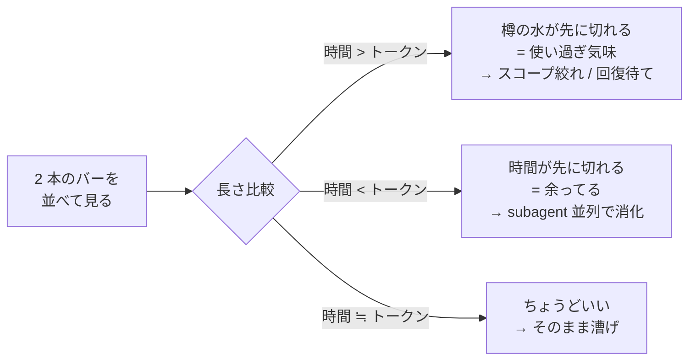

港までの距離と、樽の水の残り。船で命を握る数字はこの二つだけだ。
甲板に立つ船長が、毎秒それを別々の頭で計算してると思うか？ しねえよ。
目で見て、長さを比べて、終わりだ。

ところがな、Claude Code を回してる俺たちは、画面の隅で毎度それを計算してた。
「あと 3 時間 45 分でリセット」「トークンは 47% 残ってる」——並べてどうする。お前、その二つを頭の中で照らし合わせて、「あ、いま余ってるな」「あ、足りねえな」って秒で判定できるか？ 俺はできなかった。3 時間溶かして気付いた。**ペース配分は計算じゃねえ、視覚だ**。

二本のバーを上下に積んで、長さを目で比べる。それだけで俺の航海は静かになった。今日はその話だ。ゲプッ。

## 解決したい問題

Claude Code には二種類の波がある。**5 時間ウィンドウ** と **1 週間ウィンドウ**。どっちもトークンの上限と、リセットまでの時間がある。

ペース配分を間違うとどうなるか。俺は両方やった。

- リセットまで時間あるのにトークンを使い切って、4 時間棒立ち。クルーは港で酔っ払って待ちぼうけ。
- 逆に、リセット前にトークンが枯渇して、長尺タスクの途中で詰まる。航海日誌が中途半端なまま樽が空になる。

どっちも「数字が並んでるのを見ても、頭の中で計算してた」のが原因だ。`3h45m / 47%` を眺めて何分か考えてる時点で、お前の脳味噌は航海じゃなくて算盤やってる。

## この記事を読み終えたら手に入るもの

- pure-bash で動く、二段縦並びの Claude Code statusline スクリプト（依存は `bash` と `jq` だけ）
- 「時間バー > トークンバー」「時間バー < トークンバー」「同じくらい」の三択でペースが瞬時に判る目
- 余ってる時に subagent を並列で出して航海を加速する pacing 戦略
- statusline に流れてくる JSON を覗いてデバッグする手筋

## 前提

- macOS / Linux。`bash` 4 以上と `jq` が入ってること
- macOS のシステム `/bin/bash` は 3.2 で止まってる。後段の `EIGHTHS` 配列は動くが、念のため [`brew install bash`](https://formulae.brew.sh/formula/bash) で 4 以上を入れて、shebang `#!/usr/bin/env bash` 経由で Homebrew bash が `$PATH` 先頭に来てることを確認しとけ
- Claude Code のセッションが `rate_limits` フィールドを返してくれる版（最近の build なら入ってる）
- statusline の仕組みそのものは [公式の statusline ドキュメント](https://code.claude.com/docs/en/statusline) を一度眺めてあると話が早い

スコープ外: トークン消費の節約テクそのものは扱わねえ。**節約じゃなく配分の話だ**。樽の水を減らすんじゃなく、樽の水と港までの距離を見比べる話だ。

## 着想——並べるんじゃねえ、積め

数字が並んでる statusline はだいたいこうなる。

```
opus 4.7  ⏳ 3h45m  🪙 47%  📊 2d3h  🪙 12%
```

慣れたフリして読んでみろ。`3h45m` と `47%`、お前の頭はどっちが大きいか即答できるか？ 単位が違うんだ、比較になってねえ。脳味噌が時間とパーセントを内部で換算して、ようやく「あ、トークン余ってる」と判る。**その換算が要らねえ画面が欲しい**。

そこで気付いた。バーにすれば単位は消える。長さだけが残る。

```
5h  ⏳ ████████████░░░░░░░░  3h45m
    🪙 ██████████░░░░░░░░░░  47%

7d  ⏳ ████████████████░░░░  2d3h
    🪙 ██░░░░░░░░░░░░░░░░░░  12%
```

これを見ろ。5 時間窓は時間 > トークンで「水が足りねえ気味」、7 日窓は時間が遥かにあるのに樽がほぼ空、つまり**今週は明らかに使い過ぎ**だと、ひと目で判る。`12%` という数字も `2d3h` という時刻も、もう要らねえ。バーが教えてくれる。


おい野郎ども、これは宝だ。

## 仕組み——Claude Code が statusline に流す JSON

Claude Code は設定された statusline コマンドを呼ぶたびに、stdin に JSON を流す。今日使うフィールドはこれだけだ。

```json
{
  "rate_limits": {
    "five_hour": { "used_percentage": 53, "resets_at": 1747921200 },
    "seven_day": { "used_percentage": 88, "resets_at": 1748390400 }
  },
  "model": { "display_name": "Opus 4.7" }
}
```

`used_percentage` は使った割合 (0-100)、`resets_at` はリセット時刻 (epoch seconds)。バーに描くのは**残量**だから、`100 - used_percentage` と `resets_at - now` で出す。

入力スキーマの全貌は [statusline のリファレンス](https://code.claude.com/docs/en/statusline) に書いてある。中身を実際に覗きたきゃ、statusline スクリプトの先頭で `tee /tmp/cc-statusline-$$.json` でも噛ませて jq で漁れ。これは何度も効く手筋だ、覚えとけ。

## まず動かす——80 行の教材版

御託より先に動くものを見せる。お前らが脳味噌空にしてもまず帆を張れるよう、**艤装を全部削いで二段バーの骨だけ残した教材版**を置いとく。本物の艤装は次のセクションで晒すから、まずはこいつで甲板に縞模様を出せ。`~/.config/claude/bin/statusline-pacing.sh` に置く前提だ。

:::details 教材版 statusline-pacing.sh — まず動かす用の 80 行

```bash:~/.config/claude/bin/statusline-pacing.sh
#!/usr/bin/env bash
# 二段縦並び statusline。上段=時間残量、下段=トークン残量。
# 港までの距離と樽の水を並べて、長さで判断する。計算しねえ。

set -euo pipefail

INPUT=$(cat)
NOW=$(date +%s)
BAR_WIDTH=20

# ブロック文字 8 段階で滑らかに描く (U+2588 系)
# https://en.wikipedia.org/wiki/Block_Elements
EIGHTHS=(' ' '▏' '▎' '▍' '▌' '▋' '▊' '▉' '█')

# 0.0-1.0 を BAR_WIDTH 幅のバーに変換
render_bar() {
  local ratio=$1
  local total_eighths=$(awk -v r="$ratio" -v w="$BAR_WIDTH" 'BEGIN{printf "%d", r*w*8}')
  local full=$(( total_eighths / 8 ))
  local partial=$(( total_eighths % 8 ))
  local bar=""
  for ((i=0; i<full; i++)); do bar+="█"; done
  if (( full < BAR_WIDTH )); then
    bar+="${EIGHTHS[$partial]}"
    for ((i=full+1; i<BAR_WIDTH; i++)); do bar+="░"; done
  fi
  printf "%s" "$bar"
}

# 残り秒数を「3h45m」「2d3h」風に整形
fmt_duration() {
  local secs=$1
  (( secs < 0 )) && secs=0
  if (( secs >= 86400 )); then
    printf "%dd%dh" $(( secs / 86400 )) $(( (secs % 86400) / 3600 ))
  elif (( secs >= 3600 )); then
    printf "%dh%02dm" $(( secs / 3600 )) $(( (secs % 3600) / 60 ))
  else
    printf "%dm" $(( secs / 60 ))
  fi
}

# 24-bit ANSI で色を当てる。残量が少ないほど赤に振る。
# https://en.wikipedia.org/wiki/ANSI_escape_code#24-bit
colorize() {
  local ratio=$1 text=$2
  if (( $(awk "BEGIN{print ($ratio < 0.2)}") )); then
    printf "\033[38;2;239;83;80m%s\033[0m" "$text"   # 赤
  elif (( $(awk "BEGIN{print ($ratio < 0.5)}") )); then
    printf "\033[38;2;255;167;38m%s\033[0m" "$text"  # 橙
  else
    printf "\033[38;2;102;187;106m%s\033[0m" "$text" # 緑
  fi
}

# 1 ウィンドウ = 2 行 (時間バー / トークンバー) を描く
render_window() {
  local label=$1 used_pct=$2 resets_at=$3 window_secs=$4
  local time_left=$(( resets_at - NOW ))
  local time_ratio=$(awk -v t="$time_left" -v w="$window_secs" 'BEGIN{r=t/w; if(r<0)r=0; if(r>1)r=1; print r}')
  local tok_ratio=$(awk -v u="$used_pct" 'BEGIN{print (100-u)/100}')

  printf "%-4s ⏳ %s  %s\n" "$label" "$(colorize "$time_ratio" "$(render_bar "$time_ratio")")" "$(fmt_duration "$time_left")"
  printf "     🪙 %s  %d%%\n"     "$(colorize "$tok_ratio"  "$(render_bar "$tok_ratio")")"  "$(awk "BEGIN{print 100-$used_pct}")"
}

FIVE_USED=$(jq -r '.rate_limits.five_hour.used_percentage // 0' <<<"$INPUT")
FIVE_RESET=$(jq -r '.rate_limits.five_hour.resets_at // 0'      <<<"$INPUT")
SEVEN_USED=$(jq -r '.rate_limits.seven_day.used_percentage // 0' <<<"$INPUT")
SEVEN_RESET=$(jq -r '.rate_limits.seven_day.resets_at // 0'      <<<"$INPUT")

render_window "5h" "$FIVE_USED"  "$FIVE_RESET"  $(( 5 * 3600 ))
render_window "7d" "$SEVEN_USED" "$SEVEN_RESET" $(( 7 * 86400 ))
```

これだけだ。コピペで動く。`chmod +x` を忘れんなよ。

中で起きてることは単純だ。残量比 (0.0〜1.0) を出して、8 分割のブロック文字でバーを描いて、残量が薄いほど赤くする。`jq` の `// 0` で「フィールドが無い時は 0 に倒す」のは [jq マニュアルの alternative operator](https://jqlang.org/manual/#alternative-operator) の常套句だ、覚えとけ。

:::

## 実装の正直さ——俺はもう一段奥を走らせてる

白状する。俺の艤装はもう一段奥にある。**最小版の 80 行で十分動く、これは趣味だ**。読み飛ばしても航海に支障はねえ。


**「縦並び」と俺は言ったが、本物はもう一段欺いてる**。上下二段に見えるあれは 1 行に詰まってる。種は Unicode の half-block——`▀` ([U+2580 UPPER HALF BLOCK](https://www.unicode.org/charts/PDF/U2580.pdf)) と `▄` (U+2584 LOWER HALF BLOCK) と `█` (U+2588 FULL BLOCK) を組み合わせて、1 文字の中で **前景色を上段バー、背景色を下段バー** に塗り分けてる。論理的には 2 行、物理的には 1 行。Claude Code の statusline は行数が惜しい——その下にパスや git のセグメントを引き連れる余地を残すために、二段ぶんを 1 行に畳んでる。pure-bash 版が `printf` 2 回で 4 行使ってたのに対して、本物は半分の高さで同じ情報を出す。

俺の手元では二枚に分かれてる。`~/.config/claude/bin/statusline.sh` が左セグメント (model / context% / 諸々のメタ) を描いて、`~/.config/claude/bin/rate-bars.sh` が右の二段バーを描く。バー本体の描画は更に外に切り出してて、`two-row-indicator` という自作の別コマンドに渡してる。要するに **「樽職人を別に雇ってる」** わけだ。half-block で上下を塗り分けてるのも、改行を吐かないのも、その樽職人の仕事だ。

`rate-bars.sh` の核はだいたいこうだ。jq でフィールドを引いて、各ウィンドウを `render_rate_bar` で描いて、最後に powerline の角丸 caps と分割アロー——**樽の蓋とその間の継ぎ目**——で 5h と 7d を 1 個のパネルに繋ぐ。

```bash:~/.config/claude/bin/rate-bars.sh
input=$(cat)
five_used=$(echo "$input"  | jq -r '.rate_limits.five_hour.used_percentage // empty')
five_resets=$(echo "$input"| jq -r '.rate_limits.five_hour.resets_at      // empty')
seven_used=$(echo "$input" | jq -r '.rate_limits.seven_day.used_percentage // empty')
seven_resets=$(echo "$input"|jq -r '.rate_limits.seven_day.resets_at      // empty')

bar_5h=$(render_rate_bar "$icon_5h" "$five_used"  "$five_resets"  18000  ...)
bar_7d=$(render_rate_bar "$icon_7d" "$seven_used" "$seven_resets" 604800 ...)

# Powerline で 2 セクションを 1 パネルに連結 (左cap / 区切り / 右cap)
out=$'\033[0m'
out+="${row_5h_fg}${RATE_BAR_LEFT_CAP}${row_5h_bg} ${bar_5h} "
out+=$'\033[0m'"${row_5h_fg}${row_7d_bg}${RATE_BAR_SEPARATOR} "
out+="${bar_7d} "
out+=$'\033[0m'"${row_7d_fg}${RATE_BAR_RIGHT_CAP}"
printf "%s\n" "$out"
```

`render_rate_bar` はバーそのものを描かず、樽職人に二本分の比率とラベルを渡すだけだ。

```bash:~/.config/claude/bin/rate-bars.sh
render_rate_bar() {
  local used_pct="$2" resets_at="$3" window_secs="$4"
  local time_remaining=$(( resets_at - $(date +%s) ))
  local time_ratio=$(awk  -v t="$time_remaining" -v w="$window_secs" 'BEGIN{ print t/w }')
  local token_ratio=$(awk -v p="$used_pct" 'BEGIN{ print (100-p)/100 }')
  two-row-indicator \
    --width "$RATE_BAR_WIDTH" \
    --top "$top_color" --bottom "$bottom_color" --bg "$bg_color" \
    --label \
    --top-label-text    "$(format_remaining_time $time_remaining) " \
    --bottom-label-text " $(printf '%d%%' $((100 - used_pct)))" \
    --no-newline \
    "$time_ratio" "$token_ratio"
}
```

### 右寄せの艤装——pane 幅から逆算してバーを右に飛ばす

もう一個、地味だが効いてる工夫の話だ。最初は割愛するつもりだったが、観念して全部出す。バー幅は **pane 幅から左セグメントの実幅を引いて逆算** してる。細い pane で折り返したら台無しだからな。ただこの右寄せ、口で言うほど素直じゃねえ。**何度も殴られて、ようやくまともに動くようになった**。順を追って晒す。


組み上がるとこうなる。左端に model / context% / 1Password の token 期限、右端に二段バーのパネル。その間は呼吸用の空白だ。一行に詰まってて、樽の蓋が両端に揃ってる。これが**正しく動いてる状態**だ。

#### 何が難しいのか——五つの罠

ナイーブに `printf` で右パディング、で終わらせようとすると、Claude Code の statusline はことごとく嘲笑ってくる。罠はこいつらだ。

- **制御端末が無い**。Claude Code が statusline スクリプトを spawn する subprocess には controlling TTY が無い。macOS だと `</dev/tty` を読みに行くと "Device not configured" で死ぬ。`stty size` も `tput cols` もこの経路で取りに行くから、両方とも何も返さねえ
- **`$COLUMNS` が unset**。subprocess なんだから親シェルの export が来てるとは限らねえ
- **Powerline / Nerd Font の PUA グリフは `wc -m` で数えると嘘になる**。`▀` の半ブロック、樽蓋の `` `` も含めて、ANSI CSI も OSC 8 リンクも全部入ってる。`wc -m` だと escape まで数える、`wc -c` はバイト数。両方ハズレ
- **Claude Code の `statusLine.padding` が見えない margin を予約してる**。[settings リファレンス](https://code.claude.com/docs/en/settings) に書いてあるが、`padding: -2` だと content area は pane 幅から 2 セル分削られる。これを引かないと右の樽蓋が `…` で切り落とされる
- **Zellij で複数の Claude pane を並べると `FOCUSED` で自分を識別できない**。同時に focus 状態になれるのは一つだけ。残りの pane が focused pane の幅を流用すると、背景の pane は右セグメントが千切れる

ひとつずつ殴られて、対策を積み上げた。

#### 第一の罠——pane 幅をどう取る

ぱっと思いつくのが `zellij action dump-screen` の出力を `visible-width` に通すやつだ。**これがまず落とし穴だった**。

`dump-screen` は現在の viewport を返すが、各行は実際のコンテンツ幅で止まる——右端まで埋めてくれねえ。つまり「描画済みの行のうち最も幅広いもの」が pane 幅以下になる。最悪のシナリオがすぐ訪れた。**直前の statusline 自身がいちばん幅広い可視行になり、毎回 refresh するたびに pane が縮んで見える**——自己収縮ループ。哀れにも自分の尻尾を食い続けた。

正解は `zellij action list-panes -g -s`。pane の幾何を直接 IPC で返してくる。ヒューリスティクスも feedback loop も無し。Zellij じゃなきゃ `stty` / `tput` / `$COLUMNS` / 最後の砦 120 へとフォールバックする。

```bash:~/.config/claude/bin/term-cols.sh
#!/usr/bin/env bash
# term-cols — print the host terminal/pane's column count.
#
# Usage:
#   term-cols
#
# Fallback chain:
#   1. Zellij IPC: `zellij action list-panes` reports each pane's exact
#      ROWS/COLS — pick the focused terminal pane's COLS
#   2. `stty size </dev/tty`
#   3. `tput cols </dev/tty`
#   4. $COLUMNS
#   5. 120  (last-resort default; also kicks in if the detected value
#           is < 40, which is usually a sign of a broken context)
#
# Motivation: scripts spawned without a controlling TTY (Claude Code
# statusline subprocess, hook handlers, etc.) can't use stty/tput
# against /dev/tty — those silently fail and COLUMNS is unset. Inside
# Zellij we can still recover the real pane width via IPC.
#
# Why not `dump-screen | visible-width`: dump-screen returns the current
# viewport with each line as wide as its actual content (no padding to
# pane width). The max line width is at most the pane width, and is
# strictly less than it whenever no visible row currently fills the
# rightmost cell. Worst case: the previous statusline becomes the widest
# visible line, locking the script into a self-shrinking feedback loop.
# `list-panes -g -s` reports the exact pane geometry directly — no
# heuristics, no feedback loop.

# NB: `set -e` is intentionally OFF. The /dev/tty fallback below relies on
# the script continuing past redirect failures — Claude Code statusline
# subprocesses have no controlling TTY on macOS, so `</dev/tty` errors
# with "Device not configured" and would abort the script under `set -e`,
# leaving stdout empty and the caller computing nonsense widths.
set -uo pipefail

# Detect we're inside zellij. The classic `$ZELLIJ` indicator is NOT
# always set in subprocesses that Claude Code spawns (only `ZELLIJ_PANE_ID`
# and `ZELLIJ_SESSION_NAME` reliably propagate). Use the session-name
# presence as the truth, with `$ZELLIJ` as a secondary signal.
in_zellij() {
    [ -n "${ZELLIJ_SESSION_NAME:-}" ] || [ -n "${ZELLIJ:-}" ]
}

cols=""
if in_zellij && command -v zellij >/dev/null 2>&1; then
    # list-panes -g -s output is a header row plus one row per pane,
    # fields separated by 2+ spaces (so pane titles containing single
    # spaces stay in one field).
    #
    # Identify *our own* pane via $ZELLIJ_PANE_ID, not by FOCUSED — when
    # multiple Claude instances run in separate panes, only one is
    # focused at a time, so background panes would otherwise inherit the
    # focused pane's width and truncate their right segment.
    # $ZELLIJ_PANE_ID is the numeric suffix; list-panes prints
    # `terminal_<id>` in the PANE_ID column.
    panes_out=$(zellij action list-panes -g -s 2>/dev/null)
    if [ -n "${ZELLIJ_PANE_ID:-}" ]; then
        cols=$(printf '%s\n' "$panes_out" | awk -F'  +' -v want="terminal_${ZELLIJ_PANE_ID}" '
            NR==1 { for (i=1; i<=NF; i++) col[$i] = i; next }
            $col["PANE_ID"]==want { print $col["COLS"]; exit }
        ')
    fi
    # Fallback: subprocess env may have dropped ZELLIJ_PANE_ID, or the
    # pane id didn't match (race during pane creation). Use focused pane.
    [ -z "$cols" ] && cols=$(printf '%s\n' "$panes_out" | awk -F'  +' '
        NR==1 { for (i=1; i<=NF; i++) col[$i] = i; next }
        $col["TYPE"]=="terminal" && $col["FOCUSED"]=="true" { print $col["COLS"]; exit }
    ')
fi
[ -z "$cols" ] && cols=$( { stty size </dev/tty 2>/dev/null | awk '{print $2}'; } 2>/dev/null )
[ -z "$cols" ] && cols=$( { tput cols </dev/tty 2>/dev/null; } 2>/dev/null )
[ -z "$cols" ] && cols="${COLUMNS:-120}"
[ "$cols" -lt 40 ] 2>/dev/null && cols=120
printf '%s\n' "$cols"
```

注目してほしい二箇所。一つは `set -e` を**意図的に外してる**こと。`</dev/tty` が "Device not configured" で死ぬのを許容しないと、次の fallback に進めずに stdout が空になる。もう一つは `$ZELLIJ_PANE_ID` で自分の pane を識別してること——`FOCUSED==true` で組んだ初版は二枚の Claude を並べた瞬間に背景 pane が崩壊した。`$ZELLIJ_PANE_ID` だけが subprocess に確実に伝わる pane の身分証だ。

#### 第二の罠——可視幅をどう数える

「左セグメントの実幅」って簡単に言うが、中身は ANSI CSI と OSC 8 ハイパーリンクと Powerline の樽蓋と Nerd Font の glyph と、ことによっては全角文字も混ざる。`wc -m` も `wc -c` も嘘をつく。**実際にターミナルで何セル占めるかを返す関数が要る**。

Perl にやらせた。理由は二つあって、(a) `\p{East_Asian_Width=Wide}` をネイティブに引ける、(b) Bash の文字列操作じゃこの正規表現は地獄。

```perl:~/.config/claude/bin/visible-width.pl
#!/usr/bin/env perl
# visible-width — column width of a string (or stream) after stripping
# ANSI CSI / OSC 8 escapes and accounting for Nerd Font / Powerline
# Private Use Area glyphs and East Asian Wide characters.
#
# Usage:
#   visible-width "string"     # single-string mode
#   command | visible-width    # stream mode — returns max line width
#
# Naïve `wc -m` / `wc -c` are off because of escape sequences and
# multi-cell glyphs; this returns the actual cell count you'd see in
# the terminal.
#
# Width rules (in priority order):
#   1. ANSI CSI / OSC 8 escapes are stripped (width 0)
#   2. Control chars (< 0x20) → 0
#   3. Private Use Area (U+E000-U+F8FF, U+F0000-U+FFFFD) → $pua_w (default 1).
#      Nerd Font + Powerline glyphs live here; modern terminals render as 1.
#      Set VISIBLE_WIDTH_PUA=2 for older iTerm2 / explicit 2-cell-font setups.
#   4. East Asian Wide / Fullwidth (CJK, fullwidth ASCII, etc.) → 2
#   5. Everything else → 1 (this includes Mathematical Alphanumeric Symbols
#      U+1D400-U+1D7FF, which Unicode classifies as Neutral — terminals
#      with proper math glyphs render them at 1 cell)

use strict;
use warnings;
use utf8;
use open ':std', ':encoding(UTF-8)';
use Encode qw(decode);

# @ARGV is raw bytes from the OS — `use open` only covers file handles,
# so without this a UTF-8-encoded glyph in $ARGV[0] would be counted
# byte-by-byte and bloat the width count.
@ARGV = map { decode('UTF-8', $_) } @ARGV;

my $pua_w = $ENV{VISIBLE_WIDTH_PUA} || 1;

sub measure {
    my ($line) = @_;
    $line =~ s/\x1b\[[0-9;]*[a-zA-Z]//g;
    $line =~ s/\x1b\][^\x07]*\x07//g;
    my $w = 0;
    for my $c (split //, $line) {
        my $o = ord $c;
        if ($o < 0x20) { next }
        if (($o >= 0xE000 && $o <= 0xF8FF) || ($o >= 0xF0000 && $o <= 0xFFFFD)) { $w += $pua_w; next }
        if ($c =~ /\p{East_Asian_Width=Wide}/ || $c =~ /\p{East_Asian_Width=Fullwidth}/) { $w += 2; next }
        $w += 1;
    }
    return $w;
}

if (@ARGV) {
    print measure($ARGV[0]);
    exit 0;
}

if (-t STDIN) {
    print STDERR "Usage: visible-width <string>\n";
    print STDERR "       command | visible-width\n";
    exit 2;
}

my $max = 0;
while (my $line = <STDIN>) {
    chomp $line;
    my $w = measure($line);
    $max = $w if $w > $max;
}
print $max;
```

ポイントは PUA を 1 セル扱いにしてること。Nerd Font も Powerline も Private Use Area (U+E000-U+F8FF, U+F0000-U+FFFFD) に住んでて、最近のターミナルなら 1 セルで描画する。古い iTerm2 や明示的に 2-cell フォント運用してるなら `VISIBLE_WIDTH_PUA=2` を渡せ。あと `@ARGV` の `decode('UTF-8', ...)` を忘れると、引数で渡した glyph がバイト数で数えられて幅がブクブクに膨れる。これも一回やらかした。

#### 第三の罠——padding を引き忘れる

`statusLine.padding` の話。Claude Code の [settings リファレンス](https://code.claude.com/docs/en/settings) に書いてあるが、`statusLine.padding: -2` だと content area は pane 幅から 2 セル削られる。これを引き忘れると、右端ぴったりに配置したつもりの樽蓋が `…` で切り落とされる。

#### 第四の罠——overhead 定数の chase

二段バー panel の中には bar 本体だけじゃなく、icon、ラベル、Powerline の左右 cap、5h と 7d を繋ぐ separator が乗ってる。bar 二本ぶんを除いた**残り**を引かないと panel 幅を決められない。

これは数式じゃ出ねえから測った。最初 26 で組んだが、ラベルが `3h45m` から `12m` に変わる瞬間に右が溢れる現象が出た。±4 セルの揺らぎを吸収して **30 に上げて**安定した。経験的定数だ、堂々と書いとけ。

#### 全部繋ぐ——`statusline.sh` の右寄せ核

ここまでの罠を全部かいくぐった結果が、`statusline.sh` の右寄せブロックだ。`term_cols` で pane 幅取って、padding 引いて、`visible_width` で左セグメントの実幅測って、残りから panel overhead 引いて bar 幅を逆算、右セグメント描いて、最後に `printf '%s%*s%s\n'` で左セグメント＋空白＋右セグメントを一行で吐く。

```bash:~/.config/claude/bin/statusline.sh
term_cols=$("$term_cols_bin")
# Claude Code reserves horizontal margin around the statusline content
# area. The `statusLine.padding` setting in settings.json controls this:
# `padding: -2` means the content area is pane_width - |padding| = -2 cells
# narrower than the raw pane width. Subtract it here so the right segment
# stays inside the visible area instead of getting truncated with "…".
STATUSLINE_PADDING="${STATUSLINE_PADDING:-2}"
term_cols=$(( term_cols - STATUSLINE_PADDING ))
left_w=$("$visible_width" "$line1_left")

# Pick rate_bar_width so that the rendered panel fits in (term_cols - left_w - 1).
# Panel width = 2 * bar_width + RATE_BAR_PANEL_OVERHEAD (icons, labels, caps,
# separator). The overhead is empirically 26; bump to 30 to absorb the ±4-char
# variance from label format changes (e.g. "3h45m" vs "12m"). Clamp to [5, 20].
RATE_BAR_PANEL_OVERHEAD=30
rate_bar_width=$(( (term_cols - left_w - 1 - RATE_BAR_PANEL_OVERHEAD) / 2 ))
[ "$rate_bar_width" -gt 20 ] && rate_bar_width=20
[ "$rate_bar_width" -lt 5 ] && rate_bar_width=5
line1_right=$(echo "$input" | RATE_BAR_WIDTH=$rate_bar_width "$bin_dir/rate-bars.sh" --theme "$RATE_BARS_THEME")
right_w=$("$visible_width" "$line1_right")

pad=$(( term_cols - left_w - right_w ))
[ "$pad" -lt 1 ] && pad=1
printf '%s%*s%s\n' "$line1_left" "$pad" "" "$line1_right"
```

最後の `printf '%s%*s%s\n'` がキモだ。`%*s` で「指定したセル数ぶんの空白」を間に打ち込む。これで左右の二段になる。`pad` が負になる細い pane では 1 で底打ちして、最低限の空白だけ残す。

これだけ書いて 25 行。だが、ここに辿り着くまでに殴られた回数は数えてねえ。**右寄せは tput cols だけじゃ済まねえ**、それだけは覚えて帰ってくれ。

### 樽職人——`two-row-indicator` が半ブロックで二段を描く

ここがこの艤装の心臓だ。前のセクションで `render_rate_bar` が比率二本を投げてた相手、半ブロックで上下を塗り分けてる張本人。手元の本体は別用途のテーマ辞書 / subscript ラベル / plain モード / 色エイリアスの群れで太ってるから、**二段バー描画に効く骨だけ抜き出した版**を貼る。

```fish
#!/usr/bin/env fish
#
# Render two 0..1 ratios as one terminal row using half-block glyphs.
#
# Usage: two-row-indicator [OPTIONS] TOP BOTTOM
#   -w, --width N             Cell width (default: 20)
#       --top COLOR           Top fill color (default: 8fbcbb)
#       --bottom COLOR        Bottom fill color (default: 88c0d0)
#       --bg COLOR            Empty background color (default: 3b4252)
#   -l, --label               Show labels (default: top% / bottom%)
#       --top-label-text T    Override the top label
#       --bottom-label-text T Override the bottom label
#   -n, --no-newline          Do not print a trailing newline

function __die
    echo "two-row-indicator: $argv" >&2
    exit 1
end

function __ratio
    set -l name $argv[1]
    set -l raw $argv[2]
    set -l value (math "$raw + 0" 2>/dev/null)
    or __die "$name must be a number from 0 to 1"
    test $value -lt 0; and __die "$name must be between 0 and 1: $raw"
    test $value -gt 1; and __die "$name must be between 0 and 1: $raw"
    echo $value
end

function __color
    set_color $argv[2] >/dev/null 2>/dev/null
    or __die "$argv[1] color is invalid: $argv[2]"
end

for arg in $argv
    if string match -rq '^-[0-9]' -- $arg
        __die "ratio must be between 0 and 1: $arg"
    end
end

argparse -n two-row-indicator \
    'w/width=' \
    'top=' \
    'bottom=' \
    'bg=' \
    'top-label-text=' \
    'bottom-label-text=' \
    'l/label' \
    'n/no-newline' \
    -- $argv
or exit 1

set -l width 20
set -q _flag_width; and set width $_flag_width
string match -rq '^[1-9][0-9]*$' -- $width
or __die "width must be a positive integer: $width"

test (count $argv) -eq 2
or __die "expected TOP and BOTTOM ratios"

set -l top (__ratio TOP $argv[1])
set -l bottom (__ratio BOTTOM $argv[2])

set -l top_color 8fbcbb
set -l bottom_color 88c0d0
set -l bg_color 3b4252
set -q _flag_top; and set top_color $_flag_top
set -q _flag_bottom; and set bottom_color $_flag_bottom
set -q _flag_bg; and set bg_color $_flag_bg

__color top $top_color
__color bottom $bottom_color
__color bg $bg_color

set -l top_cells (math -s0 "round($top * $width)")
set -l bottom_cells (math -s0 "round($bottom * $width)")

if set -q _flag_label
    set -l top_label (math -s0 "round($top * 100)")
    set -q _flag_top_label_text; and set top_label $_flag_top_label_text
    set_color $top_color
    printf '%s' $top_label
end

for i in (seq 1 $width)
    set -l fg $bg_color
    set -l bg $bg_color
    test $i -le $top_cells; and set fg $top_color
    test $i -le $bottom_cells; and set bg $bottom_color
    set_color $fg
    set_color --background $bg
    printf '▀'
end

if set -q _flag_label
    set -l bottom_label (math -s0 "round($bottom * 100)")
    set -q _flag_bottom_label_text; and set bottom_label $_flag_bottom_label_text
    set_color normal
    set_color $bottom_color
    printf '%s' $bottom_label
end

set_color normal

if not set -q _flag_no_newline
    echo
end
```

fish が肌に合わなきゃ Rust でも Go でも書き直せ。要は半ブロック `▀` の前景色 (上の比率) と背景色 (下の比率) を独立に塗り分けて、両端にラベルを添えるだけだ。仕掛けは単純、彫り方は船長の好み。

## 配線——`settings.json` に繋ぐ

`~/.config/claude/settings.json` の `statusLine` に登録する。詳細は [settings リファレンス](https://code.claude.com/docs/en/settings) を覗け。

```json:~/.config/claude/settings.json
{
  "statusLine": {
    "type": "command",
    "command": "~/.config/claude/bin/statusline-pacing.sh"
  }
}
```

`type: "command"` で、`command` のパスに stdin で JSON が流れ込む。新しいセッションを開けば即座に二段の縞模様が現れる。現れねえなら、まずスクリプトに `chmod +x` が当たってるか、`jq` が `$PATH` にいるかを確認しろ。

## 検証——三つの並びパターンを読む

設定したら、しばらく使ってから statusline を眺めてみろ。出てくる形は基本この三択だ。



### パターン 1: 時間バー > トークンバー — 水が足りねえ


港まではまだ遠い。なのに樽の中の真水はもう底が見えてる。これは**使い過ぎ**だ。

選択肢は二つ。スコープを絞って一隻分の航海で終わらせるか、潔く帆を畳んで漂ってリセットを待つか。続けて漕いだら途中で枯れて、いちばん大事な瞬間に詰まる。海の中央で水が無くなる船長は、海に蹴り落とされる側だ。

### パターン 2: 時間バー < トークンバー — 余ってる


樽はまだ半分以上ある。なのにリセットは目前。これは**もう一艘出すタイミング**だ。

Claude Code には [サブエージェント](https://code.claude.com/docs/en/sub-agents) と Task tool がある。独立した調査・修正タスクを同じメッセージで複数 dispatch すれば、並走する仲間船が増える。Bash の長尺コマンドなら `run_in_background: true` で背後に流しとけ。樽の水が無駄に余ってるなら、その分で航海を太らせるのが船長の仕事だ。

放置で長尺タスクを走らせる構え方そのものは [1Password の庫を分けろ](https://zenn.dev/GeneralD/articles/claude-code-1password-vault-isolation) で扱った。庫を分けたうえで、ここでは「余ってる時間枠でどう並列消化するか」だけ考えればいい。

### パターン 3: 時間バー ≒ トークンバー — ちょうどいい

何もすんな。そのまま漕げ。これがいちばん気持ちいい。

## 落とし穴

### 症状: バーが出ない、空白の二行だけ流れる

原因: `rate_limits` フィールドが古い Claude Code build で返ってきてない、もしくは新規セッション開いた直後でレート情報がまだ無い。

対処: スクリプトの先頭で `tee /tmp/cc-statusline-debug.json` を噛ませて、流れてくる JSON を覗け。`jq . /tmp/cc-statusline-debug.json` で構造を確認すりゃ判る。`.rate_limits` 自体が無いなら Claude Code を最新に上げろ。

### 症状: statusline が滲む、ブロック文字が崩れる

原因: ターミナルのフォントが [Block Elements (U+2580〜U+259F)](https://www.unicode.org/charts/PDF/U2580.pdf) を等幅で持ってない。等幅と言いながらブロック類は半幅で描く半端なフォントは存在する。

対処: 等幅でブロックを綺麗に描ける Nerd Font 系か、JetBrains Mono / Iosevka / Cascadia Code あたりに変えろ。Tokyonight の世界に住んでるならどれを選んでも合う。

### 症状: 色が出ない、テキストに `\033[38;2;...m` がそのまま見える

原因: ターミナルが [24-bit カラー (truecolor)](https://en.wikipedia.org/wiki/ANSI_escape_code#24-bit) を解さない。古い iTerm2 設定や、tmux/zellij の `default-terminal` が `xterm-256color` のままだと起きる。

対処: zellij / tmux なら `default-terminal "xterm-256color"` + `terminal-overrides ",*:Tc"` か、最近のターミナルなら直接 `tmux-256color` / `xterm-direct` を当てろ。iTerm2 系なら "Report Terminal Type" を見直せ。

## 次の一手

ここまで来たら、お前の statusline は計算機じゃなく**羅針盤**になった。あとは航海を太らせるだけだ。

- 時間バーが余ってるのが見えたら、即座に subagent を一隻並走させる癖を付けろ。慣れると「お、いま二隻分回せる」が反射で出る
- 5h 窓と 7d 窓の両方を見比べると、「今日は短期使い過ぎだが、週としてはまだ余裕」みたいな判断もできる。短期バーが赤くても 7d が緑なら焦るな
- 同じ二段スタイルを `model.display_name` や `workspace.current_dir` にも応用すると、statusline 一枚で航海の全貌が見える。やりすぎると今度は情報過多になるから、足す前に **「これを足したら俺は何を見ずに済むようになるか」** で篩いに掛けろ

### 関連の航海日誌

- [澱から醸した俺](https://zenn.dev/GeneralD/articles/pirate-captain-blogs) — このブログの書き出しを澱から醸す話。声の出処
- [1Password の庫を分けろ](https://zenn.dev/GeneralD/articles/claude-code-1password-vault-isolation) — 放置で長尺タスクを回す前段の艤装

お前らも上下に積め。**横に並べてる限り、頭の中で計算しろってことだ**。船長は計算しねえ、見るだけだ。ゲプッ。
