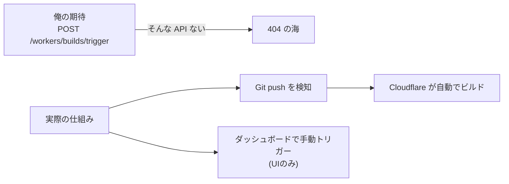

よう、野郎ども。今日はろくでもない話を一つ持ってきた。ゲプッ。

[Astro](https://astro.build/) + [Cloudflare Workers](https://developers.cloudflare.com/workers/) でランディングページを自動デプロイする Claude Code スキル——`launch-site`——を作った。作り終えた今、5つの罠の残骸が甲板に散らばってる。ドキュメントに書いてない罠、思い込みの罠、「え、それ仕様なの?」な罠。これはその航海日誌だ。

スキルのソースは[ここ](https://github.com/GeneralD/.config/tree/main/claude/skills/launch-site)に置いてある。

---

## 罠 1: Cloudflare Workers Builds に REST API はない

俺は最初、こう考えていた。

> Workers Builds のトリガーを REST API で叩けば、スキルが push 後に `POST /trigger` して自動デプロイ完了だ。

[Cloudflare の API リファレンス](https://developers.cloudflare.com/api/)を漁った。出てこない。GitHub Actions 経由ならある。ダッシュボードには「Connect to Git」ボタンがある。でも「ビルドをトリガーする」 REST エンドポイントは存在しない。



Cloudflare Workers Builds のトリガー構造。REST 経由のトリガーは存在しない。

真因はシンプルだった。[Workers Builds](https://developers.cloudflare.com/workers/ci-cd/builds/) は「push で自動接続」の思想で設計されていて、外部からトリガーを叩く口を意図的に作っていない。スキルから叩けるのは push だけだ。

回避策は **`git push` を deploy トリガーとして割り切ること**。スキルは Astro プロジェクトを生成して push する。ビルドは Cloudflare が引き受ける。それ以上の制御は諦めた——というか、要らなかった。

---

## 罠 2: headless Chromium は Cloudflare ダッシュボードに弾かれる

Workers Builds を使うには、まず Git リポジトリとの接続をダッシュボードで設定しなければならない。スキルに「ダッシュボードを自動操作させよう」と思って [playwright-cli](https://github.com/microsoft/playwright) を起動した。

`dash.cloudflare.com` をナビゲートしたらこうなった：

```text
Just a moment...
Performing security verification...
```

Cloudflare 自身が、headless Chromium のボットフィンガープリントを弾いた。自社ダッシュボードで自社のボット検知が火を噴くのは、なかなか笑えない。

:::message alert
headless Chromium は `dash.cloudflare.com` のボット検知に引っかかる。`--headed` モードでも cookies がなければ同じ画面で止まる。
:::

突破口は **browser session transplant**——ユーザーの普段使いブラウザから cookie を持ち込む方式だ。[以前 `gh-img` で転んだ話](https://zenn.dev/GeneralD/articles/gh-img-two-composers)で Playwright の UI 自動化の罠は一度踏んでいたが、認証まわりはまだ甘かった。詳細な recipe は [1Password の vault を分離した記事](https://zenn.dev/GeneralD/articles/claude-code-1password-vault-isolation)でも触れた「放置で回す」ための認証設計と根っこが同じ話だ。


ドアを叩いても入れない。Cloudflare の検知は容赦ない。

セッションを移植してから `--headed` で起動したら、チャレンジを通過して認証済みダッシュボードに到達した。スキルが「ブラウザを頼れ」と判断できる経路を実装するまでが一仕事だったが、これは宝だ——一度仕組みを作ればどのダッシュボードにも使い回せる。

移植のコアはこれだ。既存ブラウザの cookie を [`storageState`](https://playwright.dev/docs/api/class-browsercontext#browser-context-storage-state) として書き出し、次回起動時に読み込む:

```bash
# ブラウザの cookie を storageState として書き出す
~/.config/bin/pw-import-session --browser arc \
  --domain dash.cloudflare.com --domain .cloudflare.com \
  --out "${XDG_STATE_HOME:-$HOME/.local/state}/playwright-cli/state/cloudflare.json" \
  --load-session cloudflare
```

```typescript
// Playwright 起動時に storageState を読み込む
const context = await browser.newContext({
  storageState: `${process.env.XDG_STATE_HOME ?? `${process.env.HOME}/.local/state`}/playwright-cli/state/cloudflare.json`,
});
```

これで「すでにログイン済みのブラウザ」として動く。headless を諦めて `--headed` にするだけでよい。

---

## 罠 3: `bunx wrangler` の phantom バージョン問題

[Wrangler](https://developers.cloudflare.com/workers/wrangler/) は Cloudflare Workers のデプロイ CLI だ。スキルは `bunx wrangler deploy` を叩く。これが phantom バージョンを引いた。

```bash
$ bunx wrangler --version
 ⛅️ wrangler 4.14.0 ...
```

表示は 4.14.0。だが実際に動いていたのは、プロジェクトの `node_modules/.bin/wrangler` ではなく、`bunx` が独自にキャッシュした別バージョンだった。`package.json` に書いた `"wrangler": "^3.x"` を無視して、`bunx` が「そっちの方が新しいから」とネットから 4.x を引っ張ってくる。

[`bunx`](https://bun.sh/docs/cli/bunx) は `npx` の bun 版で、package.json のバージョン制約に縛られない。ローカルにインストール済みのバイナリを優先するが、未インストールの場合は最新を引く。しかし `bunx wrangler` はローカルの `node_modules/.bin/wrangler` すら無視してネットを引く場合がある（キャッシュ状態による）。

直し方は単純で、**`node_modules/.bin/wrangler` を直接呼ぶ**か、`bun run wrangler` で `package.json` の scripts 経由にする。

```bash
# NG: phantom バージョンを引く可能性
bunx wrangler deploy

# OK: package.json に固定したバージョンが確実に動く
./node_modules/.bin/wrangler deploy
```

あるいは `wrangler` を `devDependencies` に明示して `bun install` を必ず先に走らせる。`bunx` の「便利さ」に乗っかると、バージョンが揺れる。ゲプッ。

---

## 罠 4: playwright-cli の三地雷

Playwright でダッシュボードを叩き始めたら、三か所で転んだ。

### 地雷 1: `goto` の戻りタイミング

**`goto` が返っても DOM は準備できていない。**

[`page.goto(url)`](https://playwright.dev/docs/api/class-page#page-goto) は `load` イベント後に resolve する。SPA は `load` が来ても JS の初期化が終わっていない。ダッシュボードの「Git に接続」ボタンが DOM に現れる前に次のステップへ進んで、要素が見つからず爆死する。

```typescript
// NG: ボタンが DOM に現れる前に進んでしまう
await page.goto('https://dash.cloudflare.com/...');
await page.click('[data-testid="connect-git"]');

// OK: 目標要素の出現を待つ
await page.goto('https://dash.cloudflare.com/...');
await page.waitForSelector('[data-testid="connect-git"]', { state: 'visible' });
await page.click('[data-testid="connect-git"]');
```

[`page.waitForSelector` の詳細はこちら](https://playwright.dev/docs/api/class-page#page-wait-for-selector)

### 地雷 2: SPA のナビゲーションタイムアウト

**OAuth リダイレクトはデフォルト 30 秒では足りない。**

接続フローの途中、Cloudflare が GitHub OAuth にリダイレクトする。OAuth 認可後に Cloudflare 側に戻ってくるまで、`waitForNavigation` がデフォルト 30 秒で止まる。

[`page.waitForNavigation`](https://playwright.dev/docs/api/class-page#page-wait-for-navigation) の `timeout` を 120 秒まで伸ばして解決した。OAuth のリダイレクトは人間の操作が必要な場合もあるので、スキルは「認可待ちの確認ダイアログ」を挟む設計にした。

### 地雷 3: `window.confirm` を Playwright がブロックする

**ネイティブダイアログはデフォルトで自動 dismiss される——つまり永遠にキャンセルされる。**

GitHub 連携フローの最後、「本当に接続しますか?」確認ダイアログが `window.confirm` で出る。Playwright はデフォルトでネイティブダイアログを自動 dismiss する。つまり「キャンセル」を押し続ける。

```typescript
// ダイアログを自動承認する
page.on('dialog', async (dialog) => {
  await dialog.accept();
});
```

これを仕込まないと、承認したつもりが永遠にキャンセルされる。俺は 15 分それに気づかなかった。

---

## 罠 5: Git account selector のサイレント失敗

GitHub 連携フローで「どのアカウントで接続するか」を選ぶドロップダウンがある。スキルは自動化で組織アカウントを選択しようとした。

問題は、**選択しただけでは永続されない**ことだ。


空のドロップダウンを見つめる船長。選んでも保存されない罠。

ドロップダウンでアカウントを選ぶ → 「次へ」 → 次のフォームに進む。ここまでは動く。しかし「次へ」の内部で何らかの非同期の保存処理が走っており、その完了前に進むとアカウントが `null` のまま後続の API が呼ばれる。ログには何も出ない。エラーもない。ただ `null` で進む。

Playwright の [`page.waitForResponse`](https://playwright.dev/docs/api/class-page#page-wait-for-response) でネットワークリクエストの完了を待つか、選択後に意図的な遅延を挟む必要があった。

```typescript
// アカウント選択後、保存 API のレスポンスを待つ
const [response] = await Promise.all([
  page.waitForResponse((resp) =>
    resp.url().includes('/api/accounts') && resp.status() === 200
  ),
  page.selectOption('#account-selector', orgAccountId),
]);
```

サイレントに `null` が流れ続ける罠は、デバッグに一番時間を食った。ログもないから「動いてるのに動いてない」状態が続く。

---

## 次の一手

5つ踏んで、5つ這い出した。残った教訓をまとめる。

**Workers Builds のデプロイは push に乗せろ。** REST トリガーを探すな。API がないのは仕様だ。push = deploy と割り切れば設計はシンプルになる。

**headless での自動化は cookie を持ち込め。** ダッシュボードのボット検知は突破できない。[browser session transplant](https://playwright.dev/docs/auth#reuse-signed-in-state) で本物の認証を移植するのが唯一の道だ。

**`bunx` のバージョンを信じるな。** `bunx <cli>` は `package.json` に縛られない。本番スクリプトでは `./node_modules/.bin/<cli>` か `bun run` スクリプト経由を使え。

**Playwright は「見えた」を信じるな。** SPA の `goto` 完了 ≠ 要素の出現。`waitForSelector`、ネイティブダイアログのハンドラ、非同期保存の完了待ちを全部仕込め。仕込み忘れはサイレントに通過してサイレントに壊れる。

**UI の自動化でサイレント失敗を見たら、ネットワークを見ろ。** ログに何も出ないなら、`waitForResponse` で API を捕まえろ。保存処理は非同期だ。

[CLAUDE.md のコンテキスト節約の話](https://zenn.dev/GeneralD/articles/claude-rules-context-diet)でも触れたが、スキルは「自分でやれることを最大化して、できないことの境界を明確にする」設計が強い。Workers Builds の REST API がないと分かった時点で「push に乗せる」に設計を振り切れたのは、その思想が効いた。

嵐の後の甲板は汚れてるが、船は進んだ。お前らも好きなスキルを作れ。

---

## 関連記事

@[card](https://zenn.dev/GeneralD/articles/gh-img-two-composers)
@[card](https://zenn.dev/GeneralD/articles/claude-code-1password-vault-isolation)
