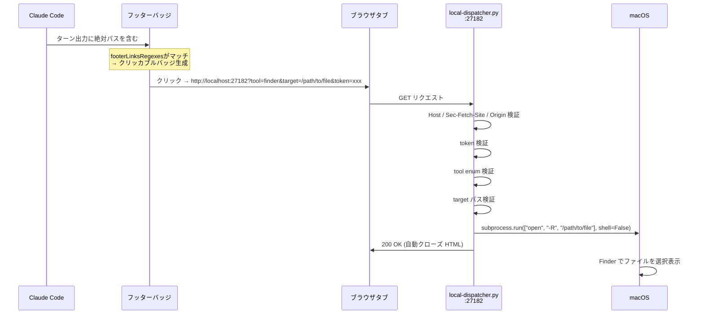

## きっかけ

[`footerLinksRegexes`](https://docs.anthropic.com/en/docs/claude-code/settings#display-settings) はターン出力にマッチした文字列をフッターバッジに変える機能だ。`url` フィールドを書けば、そのバッジがクリッカブルリンクになる。

俺がこれを知ったとき、最初に思ったのは「なんでもできるじゃねえか」だった。

ところが、`url` フィールドに書けるスキームは決まってる。`https` / `http` / `vscode` / `vscode-insiders` / `cursor` / `windsurf` / `zed` / `jetbrains` / `idea` / `slack` / `linear` / `notion` / `figma`——以上。`myapp://` みたいなカスタムスキームを書いても、Claude Code はリンクをレンダリングしない。

「じゃあ何もできねえじゃないか」——そう思ったお前は半分正しい。

**だが `http://localhost` は許可されてる。** そして localhost のエンドポイントは、お前が自分で書ける。

## 表面の挙動

まず動くものを見せる。ターン出力に絶対パスが出てきたとき、フッターに以下のようなバッジが現れる：

```text
󰱽 hero.png    🔍 hero.png    🖼 hero.png
```

- 左のバッジ（Finder）: クリックすると Finder でそのファイルを選択状態で開く（`open -R`）
- 中のバッジ（QuickLook）: クリックすると `qlmanage -p` でプレビューが飛び出す
- 右のバッジ（Preview）: PNG / PDF など画像ファイルなら Preview.app で開く

[`settings.json`](https://docs.anthropic.com/en/docs/claude-code/settings) の [`footerLinksRegexes`](https://docs.anthropic.com/en/docs/claude-code/settings#display-settings) はこう書いてある：

```json
{
  "footerLinksRegexes": [
    {
      "type": "regex",
      "pattern": "(?<![:/\\w.~@-])(?<target>/(?:[^/\\s\\\"'<>|&;`$\\n\\\\{}]+/)+(?<name>[^/\\s\\\"'<>|&;`$\\n\\\\{}]+))(?<![,.;:!?)\\]])",
      "url": "http://localhost:27182?tool=finder&target={target}&token=<YOUR_TOKEN>",
      "label": "󰱽 {name}"
    },
    {
      "type": "regex",
      "pattern": "(?<![:/\\w.~@-])(?<target>/(?:[^/\\s\\\"'<>|&;`$\\n\\\\{}]+/)+(?<name>[^/\\s\\\"'<>|&;`$\\n\\\\{}]+))(?<![,.;:!?)\\]])",
      "url": "http://localhost:27182?tool=quicklook&target={target}&token=<YOUR_TOKEN>",
      "label": "🔍 {name}"
    },
    {
      "type": "regex",
      "pattern": "(?<![:/\\w.~@-])(?<target>/(?:[^/\\s\\\"'<>|&;`$\\n\\\\{}]+/)+(?<name>[^/\\s\\\"'<>|&;`$\\n\\\\{}]+\\.(?:png|jpe?g|gif|heic|webp|bmp|tiff?|pdf)))(?<![,.;:!?)\\]])",
      "url": "http://localhost:27182?tool=open&target={target}&token=<YOUR_TOKEN>",
      "label": "🖼 {name}"
    }
  ]
}
```

パターンが長くて読めないか。要点だけ言う——**正規表現の名前付きキャプチャグループが URL テンプレートの変数になる。** `{target}` と `{name}` は、マッチした絶対パスとそのファイル名がそのまま入る。

で、このリクエストを受け取って実際に OS コマンドを叩くのが [`local-dispatcher.py`](https://github.com/GeneralD/.config/blob/main/claude/bin/local-dispatcher.py) というローカル HTTP サーバーだ。


*バッジクリック → localhost HTTP → OS コマンド*

## ソースに潜る

本体はこれだ。Python 標準ライブラリだけで書いてある：

```python:claude/bin/local-dispatcher.py
PORT = int(os.environ.get("DISPATCHER_PORT", 27182))
HOST = "127.0.0.1"

TOOLS: Final[dict[str, Tool]] = {
    "quicklook": Tool(argv=("qlmanage", "-p")),
    "finder": Tool(argv=("open", "-R")),
    "open": Tool(
        argv=("open", "-a", "Preview"),
        ext_re=re.compile(r"\.(png|jpe?g|gif|heic|webp|bmp|tiff?|pdf)$", re.IGNORECASE),
    ),
}
```

`TOOLS` が全能力の定義だ。`quicklook` は [`qlmanage -p`](x-man-page://1/qlmanage) でプレビュー、`finder` は [`open -R`](x-man-page://1/open) で Finder reveal、`open` は [`open -a Preview`](https://support.apple.com/guide/preview/welcome/mac) に画像/PDF だけ渡す。

設計の核はここにある——**`tool` パラメータは固定 enum 以外を受け付けない。** たとえトークンが漏れても、攻撃者が `tool=rm` や `tool=bash` を送りつけることはできない。

ディスパッチはシンプルだ：

```python
argv = [*tool.argv, target]
subprocess.run(argv, shell=False, check=False)
```

[`shell=False`](https://docs.python.org/3/library/subprocess.html#popen-constructor) で argv 配列直接実行。シェル経由じゃないから、`target` の中に `;rm -rf ~` を仕込んでもシェルが解釈しない。これで argv インジェクションを封じてる。

## 仕組み

全体の流れをまとめる。



### ライフサイクル

Claude Code セッションの開始・終了と連動して動く。[`SessionStart`](https://docs.anthropic.com/en/docs/claude-code/hooks#available-hooks) フックが `dispatcher-start.sh` を呼び、[`SessionEnd`](https://docs.anthropic.com/en/docs/claude-code/hooks#available-hooks) フックが `dispatcher-stop.sh` を呼ぶ。

面白いのは**参照カウント方式**だ。

複数の Claude Code セッションが同時に走ってるとき、最初のセッションがデーモンを起動し、後続セッションはそれに乗っかる。セッションが終わるたびにマーカーファイルを消して、最後の一つが消えたときだけデーモンを止める。

```bash:claude/hooks/dispatcher-start.sh（抜粋）
# Already running? (pidfile holds a live pid)
if [ -f "$pidfile" ] && kill -0 "$(cat "$pidfile" 2>/dev/null)" 2>/dev/null; then
  exit 0
fi

# --daemonize double-forks into its own session
DISPATCHER_PORT="$port" python3 "$daemon" --daemonize >/dev/null 2>&1 &
```

`--daemonize` フラグで二重フォーク（[Unix 式のデーモン化](https://en.wikipedia.org/wiki/Daemon_(computing)#Creating_a_daemon_process_in_C)）する。フック自体が終了してもデーモンは生き残り、[SIGHUP](x-man-page://3/signal) を免疫にする。

## 意外な発見

### 罠 1: 末尾の句読点が偽ファイル名に化ける

正規表現で絶対パスを拾うとき、パスに使える文字は広い。日本語もあるし、ドットやハイフンも合法だ。

しかし「合法」には落とし穴がある——ターン出力に `edit /etc/hosts,` と書かれたとき、末尾の `,` もパスの一部としてマッチする。 `target=/etc/hosts,` がデーモンに飛んで、デーモンは `400 target does not exist` を返す。バッジは無駄打ちだ。

解決策はルックビハインドアサーションだ：

```text
(?<![,.;:!?)\]])
```

パターンの末尾にこれを置いて、「直前が句読点やカッコ閉じなら拒否」する。**重要なのは「文字クラスから `,` を消す」ではないこと。** `weird,name.pdf` みたいなファイル名は実在する——その中間の `,` まで殺してはいけない。末尾だけを狙い撃ちするのがルックビハインドの仕事だ。

### 罠 2: テンプレートフラグメントがパスに見える

もう一つの罠。ターン出力にこんな文字列が混じったとする：

```text
https://github.com/{owner}/{repo}/issues/{num}
```

これは設定例で出てくる URL テンプレートだ。正規表現が `/{repo}/issues/{num}` をパスとして拾ってしまう。`{` と `}` はパス名に使える文字だからだ。

対策はシンプル——文字クラスから `{}` を除外する：

```text
[^/\\s\\\"'<>|&;`$\\n\\\\{}]+
```

これで `{repo}` みたいなテンプレートフラグメントはマッチしなくなる。ゲプッ。

### セキュリティ設計の割り切り

トークンが `settings.json` にハードコードされてる。普通、こういうのはシークレット扱いだ。

だが設計判断として「固定・コミット」を選んでいる。理由は二つ：

1. **このリポジトリはプライベート。** 外部の Web ページはトークンを読めない。
2. **トークンが漏れても意味がない。** `TOOLS` が固定 enum である以上、有効なトークンで実行できることは `qlmanage -p`, `open -R`, `open -a Preview` だけだ。攻撃者が得るのはプレビュー機能だけ。

[DNS リバインディング攻撃](https://en.wikipedia.org/wiki/DNS_rebinding)への対策は `Host` ヘッダの allowlist で：

```python
_ALLOWED_HOSTS: Final = frozenset(
    f"{name}:{PORT}" for name in ("localhost", "127.0.0.1", "[::1]")
)
```

cross-origin fetch は [`Sec-Fetch-Site`](https://developer.mozilla.org/en-US/docs/Web/HTTP/Headers/Sec-Fetch-Site) と `Origin` ヘッダで弾く。外部サイトの `` みたいな経路はここで終わる。

おい野郎ども、**宝だ**。主たる防衛線はスキームの固定列挙にある。トークンもヘッダ検証も「ないよりマシ」な補足だ——本物の壁は「受け付けるコマンドがプレビュー3種しかない」という事実だ。

## 自分のコードへの応用

### 最小構成から始めろ

まず `TOOLS` を一つだけ書いて動かせ。Finder reveal が一番わかりやすい：

```python
TOOLS: Final[dict[str, Tool]] = {
    "finder": Tool(argv=("open", "-R")),
}
```

`settings.json` のパターンは長いが、コピペして `{target}` の部分だけ確認する。バッジが出てファイルが開けば成功だ。

### Preview の拡張子 allowlist はデーモンとバッジで揃えろ

`open` ツールの `ext_re` と、`footerLinksRegexes` のパターンに書く拡張子は**必ず同期させる。** バッジは画像/PDF にしか出ないのに、デーモンが `400` を返す——という状況になると混乱する。

バッジのパターン：

```text
(?<target>/...<name>[^/...]+\.(?:png|jpe?g|gif|heic|webp|bmp|tiff?|pdf))
```

デーモンの `ext_re`：

```python
ext_re=re.compile(r"\.(png|jpe?g|gif|heic|webp|bmp|tiff?|pdf)$", re.IGNORECASE)
```

拡張子を追加するときは両方を同時に更新する。

### ツールを増やすなら TOOLS に追加する。既存エントリを広げるな

「`open <arbitrary_path>` を追加したい」と思ったとき、`open` エントリの `ext_re=None` にしてはいけない。**新しい `TOOLS` エントリを追加する。** 一つのエントリが複数の能力を持つ設計にすると、最小権限の原則が崩れる。

```python
# こうする
"open_video": Tool(
    argv=("open", "-a", "IINA"),
    ext_re=re.compile(r"\.(mp4|mov|mkv|avi)$", re.IGNORECASE),
),

# こうするな
"open": Tool(
    argv=("open", "-a", "Preview"),
    ext_re=None,  # ← 任意ファイルが開けてしまう
),
```

[`claude-code-twin-bar-rate-compass`](https://zenn.dev/GeneralD/articles/claude-code-twin-bar-rate-compass) で `settings.json` のカスタマイズを話したとき、俺は「設定ファイルは配線図だ」と言った。このデーモンはその配線の先にある端末だ——端末の能力を絞るのが、配線全体を安全にする。

### `clear` / `resume` セッションでは止めるな

[`SessionEnd`](https://docs.anthropic.com/en/docs/claude-code/hooks#available-hooks) フックは `reason` フィールドを見ている：

```bash
case "$reason" in
  clear | resume) exit 0 ;;
esac
```

`/clear` でコンテキストをリセットしても、`resume` でセッションを再開しても、デーモンは止まらない。これを外すと、`/clear` のたびにデーモンが止まって次のターンまで再起動を待つことになる。[`claude-rules-context-diet`](https://zenn.dev/GeneralD/articles/claude-rules-context-diet) で書いたコンテキストダイエットをガンガン使う俺には、この判定は外せない。

## 次の一手

動くデーモンができたら、`TOOLS` に一つ追加してみろ。

俺が次に試したいのは `open -a Xcode` で Swift ファイルを直接開くバッジだ。拡張子を `.swift` に絞って `ext_re` を設定すれば、ターンに出てきたソースファイルをワンクリックでエディタに放り込める。

`http://localhost` という「許可された穴」に、自分が制御するサーバーを差し込む——スキームの制限を利用した万能鍵の作り方だ。お前らの船で使いたいコマンドを入れて、好きに動かせ。
