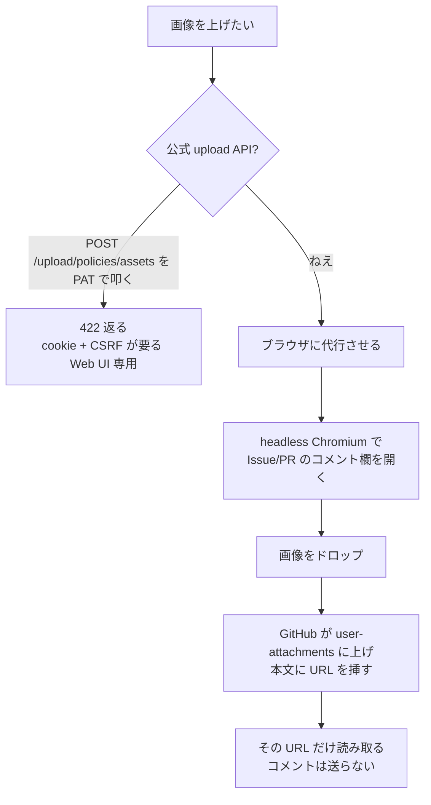

GitHub に画像を上げたい。それだけの話だ。

PR のレビューに祝いの絵を貼りたい、Issue にスクショを差し込みたい——そういう時お前らはどうする。ブラウザを開いてコメント欄にドラッグ&ドロップ、だろ。人間の手だ。スクリプトから叩けねえ。

理由はシンプルだ。**画像アップロードの公式 API が存在しねえ。** [`gh`](https://cli.github.com/manual/) にも無い。REST にも無い。GitHub のコメント欄に画像を放り込んだとき裏で走ってる `POST /upload/policies/assets` を直接叩こうとすると、`user_session` cookie と CSRF token が要って、[個人アクセストークン](https://docs.github.com/en/authentication/keeping-your-account-and-data-secure/managing-your-personal-access-tokens)を投げても `422` が返ってくる。Web UI 専用の窓口だ。

で、俺は逆から考えた。窓口が Web UI 専用なら、Web UI に代わりにやらせりゃいい。永続ログイン済みの headless Chromium にコメント欄を開かせて、画像をドロップさせる。GitHub は裏で勝手に **user-attachments** に上げて、本文に `https://github.com/user-attachments/assets/<uuid>` という URL を挿してくれる。あとはその URL だけ読み取って——**コメントは送らずに**——船を降りる。

それが `gh img <画像> <issue-or-pr-url>` だ。`~/.config/gh/bin/gh-img` に積んである一隻の小舟。今日はこいつが自分の作り主に噛みついた話と、その傷の縫い方をやる。ゲプッ。



*PAT の窓口は閉まってる。ブラウザの手を借りて回り込む*

## 何が起きたのか

道具を作ったら、まず自分で使う。当たり前だ。俺は自分の PR に祝いの絵を貼ろうとして、自分のツールをこう叩いた。

```bash
gh img /tmp/lgtm.png https://github.com/<owner>/<repo>/pull/42
```

返ってきたのはこれだ。

```text
gh-img: no comment composer found on https://github.com/<owner>/<repo>/pull/42
# exit 4
```

コメント欄が見つからねえ、だと? 目の前のページにはでかでかとコメント欄が開いてる。ブラウザでなら何度もドロップしてる、あのコメント欄だ。なのにスクリプトは「無い」と言い張って船を降りた。自分で作った浮き輪が、自分の前で腐ってやがった。

## 期待していた挙動 vs 実際

`gh img` は二つの渡し方を受ける。`owner/repo` のショートハンドと、Issue/PR の生 URL だ。同じコメント欄を探すコードが、片方では当たって片方では外す。これが意外だった。

| 渡したもの | 開くページ | コメント欄 | 結果 |
|---|---|---|---|
| `owner/repo` | `/issues/new` | 見つかる | 動く |
| `.../pull/42`（生 URL） | 会話ページ | 見つからない | exit 4 |

同じ「コメント欄」のはずだろ。なのに片方だけ捕まえられねえ。なぜだ。ここが今日の樽の底だ。

## 仮説と検証

### 仮説1: ロードが遅くて、欄が生える前に諦めてる

`gh img` はコメント欄が出るまで最大 10 秒ポーリングする。React の hydration 待ちだ。「ページが重くてタイムアウトしてんだろ」と最初はこれを疑った。ポーリング回数を増やし、ブラウザを headed で開いて目視——**ハズレ**。欄はとっくに描画済み。待ち時間の問題じゃねえ。

### 仮説2: 会話ページはログイン扱いされてない

`gh img` は `meta[name=user-login]` を読んでログイン判定する。「会話ページではこの meta が出ねえんじゃねえか」と疑った。headed で確認すると `user-login` はちゃんと出てて、login 判定（exit 3）は通過済み——**ハズレ**。だが犯人の居場所は絞れた。落ちてるのはその次、**コメント欄を探すコード**そのものだ。

### 仮説3: GitHub のコメント欄は一種類じゃない

ここで俺は、両方のページで `textarea` を片っ端から `console` に吐かせた。新規 Issue のと、会話ページのを並べて見比べた。そして気づいた。**こいつら、別物だ。**

## 真因

GitHub のコメント欄には**二種類**ある。そして、俺の finder はそのうち一種類しか名前を知らなかった。

1. **新規 Issue の React body editor**（`/issues/new`）。こいつは「俺は Markdown 欄だ」と自分から名乗る。[`placeholder`](https://developer.mozilla.org/en-US/docs/Web/HTML/Attributes/placeholder) に `Use Markdown to format your comment`、`aria-label` に `Markdown value`。「Markdown」という文字列が看板に出てる。
2. **会話ページの旧式コメント欄**（マージ済み/クローズ済み PR を含む）。こいつはどこにも「Markdown」を名乗らねえ。`placeholder` は空白一個だ。代わりに `id="new_comment_field"` という古い名札を持ってる。

俺の finder は「placeholder か [aria-label](https://developer.mozilla.org/en-US/docs/Web/Accessibility/ARIA/Attributes/aria-label) に Markdown と書いてある [textarea](https://developer.mozilla.org/en-US/docs/Web/HTML/Element/textarea) を探せ」しか言ってなかった。だから (1) は当たる。(2) は「Markdown」を名乗らねえから素通り。

そして `owner/repo` のショートハンドは必ず `/issues/new`（= (1)）しか開かない。**俺はテストでショートハンドしか踏んでなかった。** 生 URL を直接渡すという自分で用意した経路を、作り主が一度も歩いてなかった。これが澱だ。

## 直し方

直し方は分かれば一行だ。finder を「**どっちのシグナルでもマッチ**」に変える。「Markdown」を名乗ってるか、または `id="new_comment_field"` を持ってるか。どちらかが立てば拾う。

```js
// 修正後の finder（gh-img より、そのまま引いてる）
const finder = `[...document.querySelectorAll('textarea')].find(x =>
  /Markdown/i.test(x.placeholder||'') ||
  /Markdown/i.test(x.getAttribute('aria-label')||'') ||
  x.id === 'new_comment_field')`;
```

`/Markdown/i` を placeholder と aria-label の両方で見て、それでも駄目なら `id` を見る。(1) は前の二つで、(2) は最後の `id` で捕まる。これで両方の欄が網に入る。

ただし——ここが大事だ——**ドロップ先のセレクタも同じ二形にしねえと意味がねえ。** finder で欄を見つけても、画像を落とす先が古い欄を指してなきゃ、見つけた欄と落とす欄がズレる。だから drop のセレクタもこう揃える。

```bash
pw drop 'textarea[placeholder*="Markdown" i], textarea[aria-label*="Markdown" i], textarea#new_comment_field' --path "$abs_image"
```

finder の三条件と、この CSS セレクタの三つのコンマ区切りが**完全に同じ集合**を、**同じ DOM 出現順の先頭**で指す。これが効く。探す欄と落とす欄は同じ一個でなきゃならねえ。隠れたアンケート欄やインライン diff の `comment[body]` 欄はどのシグナルも立てないから、勝手に除外される。ちょうどいい。

おい野郎ども、宝はここだ。**「同じ概念に見えて DOM 上は別物の UI」は、属性一個に頼ると必ず取りこぼす。** 安定した名札（`id`）と、意味の名札（`aria-label`/placeholder）の**両方**を OR で束ねろ。片方が消えても、もう片方が船を繋ぐ。

## ついでに踏んだ罠: ブラウザ選択は env でやるな

ここからは寄り道だ。だが同じ船で溺れる兄弟がいるはずだから書いておく。

`gh img` は永続ログイン済みのプロファイルで動く。一度 `gh img --login` すれば cookie が残り、次から黙って動く。ところがこのブラウザ選択を [`PLAYWRIGHT_MCP_BROWSER`](https://github.com/microsoft/playwright-mcp) という環境変数でやると、`chromium` が [chrome-for-testing](https://developer.chrome.com/blog/chrome-for-testing) に解決されちまう。こいつは**別の cookie ストア**を持ってる。ログインが静かに消えて、エラーも出ず、毎回 exit 3 で落ちる。

だから `gh-img` はブラウザ選択を**設定ファイル**でやる。[`$XDG_CONFIG_HOME`](https://specifications.freedesktop.org/basedir-spec/latest/)`/playwright-cli/cli.config.json` にこう書く。

```json
{
  "browser": {
    "browserName": "chromium",
    "launchOptions": { "channel": "chromium", "headless": true }
  }
}
```

`channel: "chromium"` を [`launchOptions`](https://playwright.dev/docs/api/class-browsertype#browser-type-launch-option-channel) で指定すれば、永続ログインプロファイルを掴んだままのブラウザが起動する。同じ "chromium" って文字列なのに、env だと別物に化けてファイルだと正しく掴む。ブラウザ選択だけはファイルに刻め。

cookie 自体は [`$XDG_STATE_HOME`](https://specifications.freedesktop.org/basedir-spec/latest/)`/gh-img/userdata` に `0700` で置いてある。アカウントと等価の秘密だからな。**秘密は庫を分けて隔離する**——この感覚は別の航海で一本書いた。地続きだから寄ってけ。

@[card](https://zenn.dev/GeneralD/articles/claude-code-1password-vault-isolation)

## 安全弁: 信頼できない URL に画像を落とすな

もう一つだけ。画像はロードしたページに**無条件で**ドロップされる。そして `gh img` の認証チェックはページ側が制御する `meta[name=user-login]` しか見ない。つまり悪意あるページがその meta と「Markdown」欄を仕込んでりゃ、お前のローカルファイルを受け取れちまう。

唯一の防壁は、ページを開く前に host を検証することだ。`gh-img` は `https://github.com/*` という——`github.com` の**直後にスラッシュが来る**——パターンだけを通す。この一個のスラッシュが `github.com.evil.com` や `github.com@evil.com` みたいな成りすましを弾く。

exit code も覚えとくと再現が速い。

| code | 意味 |
|---|---|
| `2` | 入力不正（使い方ミス / github.com 以外の host / 画像が無い） |
| `3` | 未ログイン（`gh img --login` を打て） |
| `4` | コメント欄が見つからない（今日の犯人） |
| `5` | ドロップ失敗 |
| `6` | URL が返ってこない（タイムアウト or 拒否） |

ファイルは [`DataTransfer`](https://developer.mozilla.org/en-US/docs/Web/API/DataTransfer) として合成されてページに渡る。作業ディレクトリの外でも読めるから、パスの境界は防壁にならねえ。守ってるのは host gate だけだ。安全弁は一個しかねえ、錆びさせるな。

## 次の一手

月曜の朝、お前らが再現できる核だけ瓶に詰めて渡す。

- **使い方**: [Homebrew](https://brew.sh/) で [`playwright-cli`](https://formulae.brew.sh/formula/playwright-cli) を入れて、`gh img --login` を一回。あとは `gh img <png> <issue-or-pr-url>` で URL が標準出力に出る。[`gh` のエイリアス](https://cli.github.com/manual/gh_alias)に積めば `gh img` で呼べる。
- **思想**: 第三者の公開ホストに画像を上げるな。GitHub 自身の [user-attachments](https://docs.github.com/en/get-started/writing-on-github/working-with-advanced-formatting/attaching-files) に置けば、添付は repo の可視性に従う。private repo の添付は認証越しでしか `200` を返さねえ。匿名で叩きゃ `404` だ。つまり**第三者公開ホストじゃねえ**。これが大きい。
- **設計の教訓**: UI を要素一個の属性で掴むな。安定 ID と意味属性を OR で束ねろ。そして——自分で用意した経路は、自分で全部歩け。俺は二本道を作って一本しか踏まず、残り一本で転んだ。テストは `owner/repo` だけじゃなく生 URL も叩け。

そして——船を一隻まるごと渡す。能書きより現物だ。下の全文を `~/.config/gh/bin/gh-img` に置いて実行権を立て、[`gh` のエイリアス](https://cli.github.com/manual/gh_alias)に `img: '!~/.config/gh/bin/gh-img "$@"'` を一行足せば、お前の手元でそのまま動く。`brew install playwright-cli` と `playwright-cli install-browser chromium` だけ先に済ませとけ。秘密リテラルは一個も無い——cookie は実行時に `$XDG_STATE_HOME` 下の専用プロファイルに溜まるだけだ。これが今日の宝の本体だ。持ってけ。

:::details gh-img 全文（そのまま `~/.config/gh/bin/gh-img` に置けば動く）

```bash:~/.config/gh/bin/gh-img
#!/usr/bin/env bash
#
# gh-img: upload an image to GitHub user-attachments and print its URL.
#
# Usage:
#   gh img <image> <issue-or-pr-url>    # upload; prints the user-attachments URL
#   gh img <image> <owner/repo>         # same, via that repo's new-issue composer
#   gh img --login [url]                # one-time interactive (headed) login
#
# Drives a persistent, authenticated headless Chromium (via playwright-cli) to
# drop the image onto a real comment composer on the given page, then reads the
# https://github.com/user-attachments/assets/<uuid> URL that GitHub inserts —
# WITHOUT submitting any comment. The asset inherits the visibility of the repo
# whose composer it is dropped on, so private-repo uploads stay auth-gated. This
# is GitHub's OWN storage, not a third-party public host.
#
# Why a real browser and not raw HTTP: the upload-policy endpoint
# (POST /upload/policies/assets) is web-UI only — a PAT returns 422; it needs the
# user_session cookie + CSRF token. Letting the live composer perform the upload
# lets the browser mint/send the correct token; we just read back the URL. If an
# official upload API ever ships, migrate this to "gh api" and drop playwright.
#
# Why a config file (not the PLAYWRIGHT_MCP_BROWSER env var) selects the browser:
# the "chromium" channel keeps the persistent login profile, whereas
# PLAYWRIGHT_MCP_BROWSER=chromium resolves to chrome-for-testing, which uses a
# DIFFERENT cookie store and silently drops the login. So browser selection is
# the one setting that genuinely needs the config file; everything else is env.
#
# Requires:
#   - playwright-cli (brew install playwright-cli)
#   - a Chromium under PLAYWRIGHT_BROWSERS_PATH (playwright-cli install-browser chromium)
#   - the "gh img" alias (shipped in this repo's gh/config.yml); or call by path
# Session cookies live in a dedicated profile under XDG_STATE_HOME (see
# PLAYWRIGHT_MCP_USER_DATA_DIR below); they are account-equivalent secrets —
# never committed, 0700. Run "gh img --login" once per machine. Single-run tool:
# a fixed session/scratch means do not invoke it concurrently with itself (a
# second run's close would kill the first's browser).

set -u
set -o pipefail

session="ghimg"

# Keep playwright XDG-clean even when invoked from a context lacking the env vars.
export PLAYWRIGHT_DAEMON_SESSION_DIR="${PLAYWRIGHT_DAEMON_SESSION_DIR:-${XDG_STATE_HOME:-$HOME/.local/state}/playwright-cli}"
export PLAYWRIGHT_BROWSERS_PATH="${PLAYWRIGHT_BROWSERS_PATH:-${XDG_DATA_HOME:-$HOME/.local/share}/ms-playwright}"
# Pin the login cookie store to a fixed, cwd-independent path (a dedicated gh-img
# profile). Without this, playwright keys the persistent profile by the workspace
# (cwd) hash, so a login done from one directory would be invisible when the
# script later runs from its scratch dir. STATE tier; account-equivalent secret.
export PLAYWRIGHT_MCP_USER_DATA_DIR="${PLAYWRIGHT_MCP_USER_DATA_DIR:-${XDG_STATE_HOME:-$HOME/.local/state}/gh-img/userdata}"
mkdir -p "$PLAYWRIGHT_MCP_USER_DATA_DIR" 2>/dev/null && chmod 700 "$PLAYWRIGHT_MCP_USER_DATA_DIR" 2>/dev/null

# Browser-selection config — kept in XDG_CONFIG_HOME (never $HOME), self-created
# so the script is portable to a fresh machine. Referenced via --config because
# its name isn't the cwd-walk default (.playwright/cli.config.json).
pw_config="${XDG_CONFIG_HOME:-$HOME/.config}/playwright-cli/cli.config.json"
# Contain playwright's per-call ".playwright-cli/" snapshot dir so it never lands
# in the caller's cwd (e.g. a git repo). Cache dir, outside any repo.
scratch="${XDG_CACHE_HOME:-$HOME/.cache}/gh-img"

pw() { playwright-cli -s="$session" "$@"; }
die() { printf 'gh-img: %s\n' "$1" >&2; exit "${2:-1}"; }
# Read one scalar value from a --raw eval (value is always the last output line).
pweval() { pw --raw eval "$1" 2>/dev/null | tail -1; }
# Closes the browser (keeps the persistent cookie profile) and clears snapshots.
# Wired to EXIT/INT/TERM so a Ctrl-C mid-poll never leaks the browser daemon.
cleanup() { pw close >/dev/null 2>&1; rm -rf "$scratch/.playwright-cli"; }

# GitHub has two composer shapes and no single attribute covers both:
#  1. The new-issue React body editor advertises "Markdown" via its aria-label
#     ("Markdown value") or placeholder ("Use Markdown to format your comment").
#  2. The classic issue/PR *comment* box (conversation pages, incl. merged/closed
#     PRs) advertises Markdown NOWHERE — its placeholder is a bare " " — but it
#     carries the stable id="new_comment_field". The owner/repo route only ever
#     hits shape 1, so shape 2 went unnoticed until an image was dropped onto a
#     PR/issue URL directly (then: "no comment composer found", exit 4).
# Match on either signal. The drop CSS selector below mirrors this exact set with
# the same first-in-DOM-order pick, so drop and poll always target the SAME
# element (the hidden survey "feedback" and inline-diff "comment[body]" textareas
# advertise none of these signals and are excluded).
finder="[...document.querySelectorAll('textarea')].find(x => /Markdown/i.test(x.placeholder||'') || /Markdown/i.test(x.getAttribute('aria-label')||'') || x.id === 'new_comment_field')"

command -v playwright-cli >/dev/null 2>&1 || die "playwright-cli not found (brew install playwright-cli)" 127

ensure_config() {
    [ -f "$pw_config" ] && return 0
    mkdir -p "$(dirname "$pw_config")" || return 1
    printf '%s\n' '{ "browser": { "browserName": "chromium", "launchOptions": { "channel": "chromium", "headless": true } } }' > "$pw_config"
    chmod 600 "$pw_config"
}

# --- login mode -------------------------------------------------------------
if [ "${1:-}" = "--login" ]; then
    url="${2:-https://github.com/login}"
    ensure_config || die "could not write $pw_config" 1
    mkdir -p "$scratch"; cd "$scratch" || die "cannot enter scratch dir $scratch" 1
    trap cleanup EXIT INT TERM
    pw open --persistent --headed --config "$pw_config" "$url" || die "could not open browser" 1
    printf 'gh-img: a browser window is open. Log in to GitHub (incl. 2FA), then press Enter here... ' >&2
    read -r _
    printf 'gh-img: session saved.\n' >&2
    exit 0
fi

# --- argument parsing -------------------------------------------------------
image="${1:-}"
target="${2:-}"
{ [ -n "$image" ] && [ -n "$target" ]; } || die "usage: gh img <image> <issue-or-pr-url>  |  gh img --login" 2
[ -f "$image" ] || die "image not found: $image" 2

# resolve absolute image path (relative to caller's cwd, BEFORE we cd to scratch)
img_dir=$(cd "$(dirname "$image")" 2>/dev/null && pwd) || die "cannot resolve directory of: $image" 2
abs_image="$img_dir/$(basename "$image")"

# normalize target: a github.com URL as-is, or owner/repo -> that repo's new-issue
# page. Reject every non-github host: the image is dropped onto whatever page
# loads, and the auth check only reads a page-controlled meta[name=user-login], so
# an untrusted URL carrying that meta + a "Markdown" textarea could receive the
# local file via the drop. Uploads are only meaningful on github.com
# (user-attachments), so gate on host BEFORE opening the page. The leading-slash
# in the accept pattern also rejects look-alikes (github.com.evil.com, github.com@evil.com).
case "$target" in
    https://github.com/*) page_url="$target" ;;
    http://*|https://*)   die "target host must be github.com: $target" 2 ;;
    */*)                  page_url="https://github.com/${target}/issues/new" ;;
    *)                    die "target must be a github.com issue/PR URL or owner/repo: $target" 2 ;;
esac

ensure_config || die "could not write $pw_config" 1
mkdir -p "$scratch"; cd "$scratch" || die "cannot enter scratch dir $scratch" 1
trap cleanup EXIT INT TERM

# --- open + auth check (retry: a slow load must not read as logged-out) ------
pw open --persistent --config "$pw_config" "$page_url" >/dev/null 2>&1 || die "could not open $page_url" 1

login=""
for _ in 1 2 3 4 5 6 7 8 9 10; do
    login=$(pweval "() => (document.querySelector('meta[name=user-login]') || {}).content || ''" | tr -d '"')
    [ -n "$login" ] && break
    sleep 1
done
[ -n "$login" ] || die "not logged in (or session expired) — run: gh img --login" 3

# --- wait for the composer to hydrate (React) -------------------------------
ready=""
for _ in 1 2 3 4 5 6 7 8 9 10; do
    [ "$(pweval "() => ($finder) ? '1' : ''" | tr -d '"')" = "1" ] && { ready=1; break; }
    sleep 1
done
[ -n "$ready" ] || die "no comment composer found on $page_url" 4

# --- drop the image onto the composer (selector mirrors $finder: Markdown
#     placeholder/aria-label OR id="new_comment_field", first-in-DOM-order) ---
# Note: "drop --path" reads the local file in playwright-cli's own Node process
# and hands it to the page as a synthesized DataTransfer — it is NOT gated by the
# allowUnrestrictedFileAccess config flag (that flag gates the @playwright/mcp
# server's browser_file_upload tool, a different mechanism). So $abs_image may
# live anywhere the caller can read, including outside this script's scratch cwd —
# which is exactly why the github.com host gate above (not a workspace boundary)
# is what protects against an untrusted target page receiving the file.
pw drop 'textarea[placeholder*="Markdown" i], textarea[aria-label*="Markdown" i], textarea#new_comment_field' --path "$abs_image" >/dev/null 2>&1 || die "drop onto composer failed" 5

# --- poll the composer for the inserted user-attachments URL ----------------
# Rely on the timeout, not a substring heuristic: GitHub shows an
# "" placeholder mid-upload, so matching on words like
# "failed" would misfire on a file literally named e.g. build-failed.png.
url=""
for _ in {1..20}; do
    val=$(pweval "() => { const t = $finder; return t ? t.value : ''; }")
    match=$(printf '%s' "$val" | grep -oiE 'https://github\.com/user-attachments/assets/[0-9a-f-]+' | head -1)
    [ -n "$match" ] && { url="$match"; break; }
    sleep 2
done

# Discard the unsent draft text; the EXIT trap then closes the browser.
pw --raw eval "() => { const t = $finder; if (t) { const s = Object.getOwnPropertyDescriptor(window.HTMLTextAreaElement.prototype, 'value').set; s.call(t, ''); t.dispatchEvent(new Event('input', { bubbles: true })); } }" >/dev/null 2>&1

[ -n "$url" ] || die "upload did not return a user-attachments URL (timed out or rejected)" 6
printf '%s\n' "$url"
```

:::

公式 upload API がいつか降ってきたら、この小舟は捨てる。[`gh api`](https://cli.github.com/manual/gh_api) に乗り換えて playwright ごと海に蹴り落とす。それまではこいつが俺の船を運ぶ。お前らの船でも好きに使え。ゲプッ。
