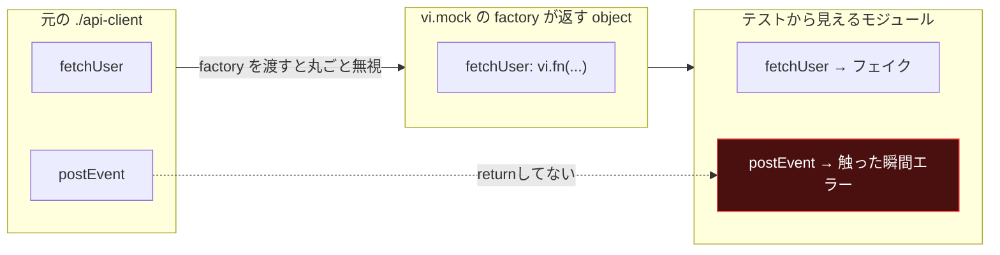

## 何が起きたのか

よう、野郎ども。

[`vi.mock`](https://vitest.dev/api/vi.html#vi-mock) でググると、出てくるのは大体 hoisting の話だ。「`beforeEach` の中で参照できない」「TDZ でコケた」——そういう記事ばっかり出てくる。今日話すのはそれとは別物、もっとタチの悪い時限爆弾の話だ。

きっかけは些細だった。本番コードに export を1つ足しただけだ。それだけで、触ってもいない無関係な複数のテストファイルが一斉に赤くなった。ログに残ってたのはこれだ。

```text
FAIL src/report.test.ts > buildUserReport > renders the user name
Error: [vitest] No "postEvent" export is defined on the "./api-client" mock. Did you forget to return it from "vi.mock"?
```

見りゃ分かる、って? 焦ってる時にこの一行だけ見て「export 足し忘れたか?」って `api-client.ts` を二度見した。中身は合ってた。犯人はそこじゃなかった。

## 期待していた挙動 vs 実際

| | 期待 | 実際 |
|---|---|---|
| 本番コードに export を1つ追加 | 使ってるコード / テストにだけ影響が出る | 触ってすらいない複数のテストファイルまで red になる |
| `vi.mock` で明示的に指定していない export | 元の実装がそのまま生きてるはず(だって消してないし) | 一律 `undefined` |

ここが噛み合わない。export は正しく存在してる。なのに「無い」と言われる。

## 仮説と検証


*ハズレ仮説を追って、静かに航海する。*

### 仮説1: hoisting / TDZ の問題

`vi.mock` の話でエラーが出たら、まずコレを疑う。ggった記憶がそのまま脳に染み付いてる。

- 検証: `vi.mock` の呼び出し位置、import の並び順を全部見直した
- 結果: ハズレ。そもそもエラーメッセージが TDZ の文言じゃない。「export が無い」であって「参照が早すぎる」じゃない

### 仮説2: api-client.ts の export 定義ミス

さっき書いた通り、疑うのはここが自然だ。タイポで export 名が変わったんじゃないか、とか。

- 検証: `api-client.ts` を直接開いて `postEvent` の宣言を確認
- 結果: ハズレ。ちゃんと `export async function postEvent(...)` で存在してる。ここは無罪だ

### 仮説3(当たり): テストファイル側の `vi.mock` の書き方

疑いの目を production から test に移した瞬間、答えが見えた。落ちてる全部のテストファイルに共通するもの——`vi.mock('./api-client', () => ({ ... }))` という書き方だ。

## 真因

`vi.mock` に factory 関数を渡すと、Vitest は `./api-client` というモジュール**全体**を、その factory が返した object で置き換える。部分的な上書きじゃない。丸ごと差し替えだ。



factory が `fetchUser` しか返さなければ、`postEvent` は「元の実装が生きてる」わけじゃねえ。だが、素の `undefined` になって静かに転がってるわけでもねえ。Vitest は factory が返した object をそのまま公開せず、Proxy で包んで見張ってやがる。だから factory が返さなかった export に指一本触れた瞬間——**関数として呼ぶ前だ、`typeof` で覗いただけでも**——専用のエラーが飛んでくる。`undefined` を呼んで `TypeError` で沈む、なんて悠長な話じゃねえ。触れた時点でジ・エンドだ。

これは Vitest の公式ドキュメントにも書いてある挙動で、`vi.mock` 単体としてはバグでも何でもない。仕様通りだ。踏み抜くのはそこじゃない。


*積荷を丸ごと別の樽にすり替える。*

**時限爆弾の正体はこれだ**——「今は使ってない export」を後から本番コードが使い始めた瞬間に発火する。書いた時点では `{ fetchUser: fake }` で十分だった。テストは green だった。だが後になって誰かが `api-client.ts` に `postEvent` を足し、`report.ts` がそれを使い始める。その瞬間、**一度も編集していないテストファイル**が過去の遺物になる。

さっきのエラーメッセージ、実は続きがあった。全文はこうだ。

```text
Error: [vitest] No "postEvent" export is defined on the "./api-client" mock. Did you forget to return it from "vi.mock"?
If you need to partially mock a module, you can use "importOriginal" helper inside:

vi.mock(import("./api-client"), async (importOriginal) => {
  const actual = await importOriginal()
  return {
    ...actual,
    // your mocked methods
  }
})
```

(Vitest が出す例は `import("./api-client")` を渡す型安全な書き方だが、今回の直しは今まで通り文字列指定のままで十分だ。考え方は同じ)

読めよ、俺。Vitest の方はちゃんと答えを最初から言ってた。

## 直し方

おい野郎ども、宝はこれだ。修正はたった1行、diff にすると2行だ。

```diff
- vi.mock('./api-client', () => ({
-   fetchUser: vi.fn().mockResolvedValue({ id: 'u1', name: 'Ada' }),
- }))
+ vi.mock('./api-client', async (importOriginal) => ({
+   ...(await importOriginal()),
+   fetchUser: vi.fn().mockResolvedValue({ id: 'u1', name: 'Ada' }),
+ }))
```

[`importOriginal`](https://vitest.dev/guide/mocking/modules#mocking-a-module)(公式の Mocking Modules ガイドに載ってるやつだ)でオリジナルの export を全部引っ張ってきて、それを spread で下敷きにする。そのうえで、本当に差し替えたい export だけを後ろで上書きする。

これで「明示的に指定した export だけがフェイク、それ以外は本物」になる。未来、`api-client.ts` に export が10個増えようが、この書き方のテストは何も壊れない。壊れるとしたら、今まさにお前が触ってる export だけだ——それは正しい壊れ方だ。

前の書き方は海に蹴り落とせ。object literal を手書きで丸ごと差し替えるやつは、書いた瞬間から未来の地雷だ。

## 再現手順


*地図とコンパスは渡した。あとはお前の船で確かめろ。*

信じられねえなら自分の手でやってみろ。ここに書いた通りに叩けば、同じ green→red→green を再現できる。

### 0. プロジェクトを作る

```bash
mkdir vitest-mock-blind-spot && cd vitest-mock-blind-spot
mkdir src
```

### 1. package.json

```json:package.json
{
  "name": "vitest-mock-blind-spot-repro",
  "private": true,
  "type": "module",
  "devDependencies": {
    "vitest": "^3.0.0"
  }
}
```

### 2. vitest.config.ts

```ts:vitest.config.ts
import { defineConfig } from 'vitest/config'

export default defineConfig({
  test: {
    environment: 'node',
  },
})
```

### 3. src/api-client.ts(最初のバージョン)

薄い API クライアント層のつもりで書く。まずは `fetchUser` だけ。

```ts:src/api-client.ts
export async function fetchUser(id: string): Promise<{ id: string; name: string }> {
  const res = await fetch(`https://example.com/users/${id}`)
  return res.json()
}
```

### 4. src/report.ts

```ts:src/report.ts
import { fetchUser } from './api-client'

export async function buildUserReport(id: string): Promise<string> {
  const user = await fetchUser(id)
  return `report for ${user.name}`
}
```

### 5. src/report.test.ts

`./api-client` を部分的にモックする、よくある書き方だ。

```ts:src/report.test.ts
import { describe, expect, it, vi } from 'vitest'
import { buildUserReport } from './report'

vi.mock('./api-client', () => ({
  fetchUser: vi.fn().mockResolvedValue({ id: 'u1', name: 'Ada' }),
}))

describe('buildUserReport', () => {
  it('renders the user name', async () => {
    const result = await buildUserReport('u1')
    expect(result).toBe('report for Ada')
  })
})
```

### 6. 依存を入れてテストを走らせる(green)

```bash
npm install
npx vitest run
```

```text
✓ src/report.test.ts (1 test) 2ms

Test Files  1 passed (1)
     Tests  1 passed (1)
```

ここまでは何の問題もない。宝はまだ見えてない。

### 7. 本番コードに export を1つ足す(break)

`api-client.ts` に `postEvent` を追加し、`report.ts` がそれを使うように変更する。テストファイルは**一切触らない**。

```ts:src/api-client.ts
export async function fetchUser(id: string): Promise<{ id: string; name: string }> {
  const res = await fetch(`https://example.com/users/${id}`)
  return res.json()
}

export async function postEvent(name: string, payload: Record<string, unknown>): Promise<void> {
  console.log(`[event] ${name}`, payload)
}
```

```ts:src/report.ts
import { fetchUser, postEvent } from './api-client'

export async function buildUserReport(id: string): Promise<string> {
  const user = await fetchUser(id)
  await postEvent('report_built', { userId: id })
  return `report for ${user.name}`
}
```

もう一度走らせる。

```bash
npx vitest run
```

```text
❯ src/report.test.ts (1 test | 1 failed)
  × buildUserReport > renders the user name
    → [vitest] No "postEvent" export is defined on the "./api-client" mock.
      Did you forget to return it from "vi.mock"?
```

来た。無関係なはずのテストが赤い。

### 8. 1行 diff を当てる(fix)

`src/report.test.ts` の `vi.mock` だけを直す。

```diff
- vi.mock('./api-client', () => ({
-   fetchUser: vi.fn().mockResolvedValue({ id: 'u1', name: 'Ada' }),
- }))
+ vi.mock('./api-client', async (importOriginal) => ({
+   ...(await importOriginal()),
+   fetchUser: vi.fn().mockResolvedValue({ id: 'u1', name: 'Ada' }),
+ }))
```

```bash
npx vitest run
```

```text
✓ src/report.test.ts (1 test) 2ms

Test Files  1 passed (1)
     Tests  1 passed (1)
```

green に戻った。`postEvent` は元の実装(今回はただの `console.log`)がそのまま生きてる。ゲプッ。

## 次の一手

- **検知は lint に投げろ**: 「`vi.mock` の factory が手書きの object literal を直接返してる」パターンは静的に検出できる。ESLint のカスタムルールなり codemod なり、俺は今度自分で仕込むつもりだ。人間の目視レビューに頼るな
- **なぜ踏み抜きやすいか**: 書いた瞬間はテストは green だ。壊れるのは「未来、誰かが export を足した瞬間」——コードレビューの時点では誰も気づけない。時限爆弾ってのはそういうもんだ

再現手順の話が出たついでだ。この記事のスニペットも、公開前に素のマシンで green→red→green を通してから書いてる。ブログの再現性の話は前に一度、[別の航海](https://zenn.dev/GeneralD/articles/ai-blog-repro-kernel-sandbox)で書いた。気になったら覗いてみろ。

俺は `importOriginal` の spread を今日から標準装備にする。お前らは好きにしろ。ただし、次に export を足すのはお前かもしれない、ってことだけは覚えとけ。ゲプッ。
